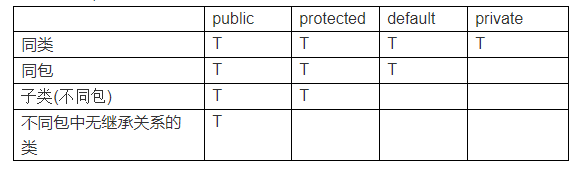
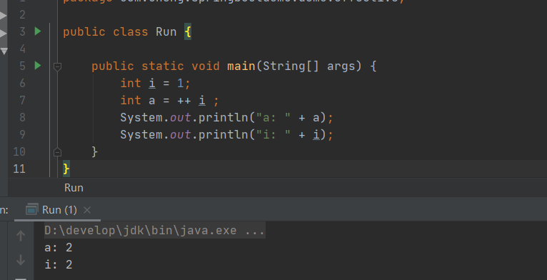
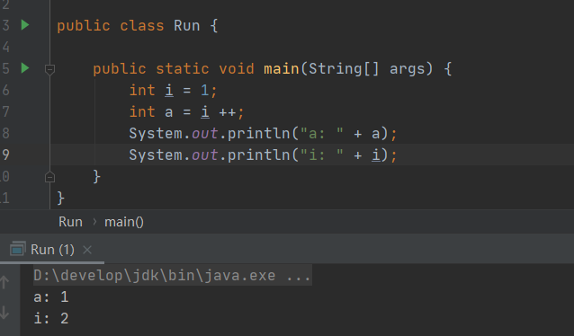

### 访问权限修饰符
方法的访问控制：  
    
对于类的访问权限，仅有两个选择：包访问权限或public。

### 继承
**初始化基类**  
Java会自动在导出类的构造器中插入对基类构造器的调用。但是，如果没有默认的基类构造器，或者想调用一个带参数的基类构造器，就必须用关键字super显式地编写调用基类构造器的语句，
并且配以适当的参数列表。而且，调用基类构造器必须是你在导出类构造器中要做的第一件事。  

到底是该用组合还是继承，一个最清晰的判断办法就是问一问自己是否需要从新类向基类进行向上转型。如果必须向上转型，则继承是必要的；但如果不需要，则应当好好考虑自己是否需要继承。

### final关键字
**final数据**  
对于基本类型，final使数值恒定不变；而对于对象引用，final使引用恒定不变；数组也是保证引用不变。  
**空白final**  
所谓空白final是指被声明为final但又未给定初值的域。空白final在构造器中进行赋值，为此，一个类中的final域就可以做到根据对象的而有所不同，却又保持其恒定不变的特性。  
**final参数**  
在方法中无法更改参数引用所指向的对象。  
**final方法**  
明确方法禁止覆盖时，将方法设置为final。  
**final类**  
不可继承，并且也因此，final类中的所有方法都隐士指定为时final的，因为无法覆盖它们。

### 动态绑定（多态）
动态绑定是指在执行期间（非编译期）判断所引用对象的实际类型，根据其实际的类型调用其相应的方法。例如方法接受基类参数，实际传入导出类作为参数，则程序在运行时才确定被
调用的代码。
在Java中，动态绑定时默认行为，不需要添加额外的关键字来实现多态。  
多态解释：指不同类的对象对同一消息做出响应，即同一消息根据发送对象的不同而采取不同的行为方式。

### RTTI
向下转型时运行时类型识别  
加括弧形式的类型转换，在进入运行期时仍然会对其进行检查，以便保证它的确是我们希望的那种类型。如果不是，就会返回一个ClassCaseException（类型转换异常）。这种
运行期间对类型进行检查的行为称作为“运行时类型识别”（RTTI）。

### this关键字
this关键字只能在方法内部使用，表示对"调用方法的那个对象"的引用。  
通常写this的时候，都是指"这个对象"或者"当前对象"，而且它本身表示对当前对象的引用。在构造器中，如果为this添加了参数列表，那么就有了不同的含义。这将产生对符合此
参数列表的某个构造器的明确调用。

### static关键字
静态域只有在所属类的第一个对象被创建或者第一次访问该类的静态域时，才会被初始化。此后，静态域不会再次被初始化。访问类的一个静态域，该类的所有静态域都会被初始化。简而言之静态
初始化只在Class对象首次加载的时候进行一次。

### 自动装箱
它允许程序员将基本类型和装箱基本类型混用，按需自动装箱和拆箱。它们之间的差别变得模糊，但是并没有完全的消除。除了语意上有微妙的差别，在性能上也有着明显的差别。
```java
public static void main(String[] args) {
    Long sum = 0L;
    for (int i = 0;i < Integer.MAX_VALUE;i ++) {
        sum += i;
    }
    System.out.println(sum);   
}
```
变量sum被声明成Long而不是long，意味着程序每次往Long sum中增加long时构造一个实例。所以结论很明显：要优先使用基本类型而不是装箱基本类型，要当心无意识的自动装箱。

### ++i与i++
++i等同于i = i + 1
++i: 先执行运算，再生成值  
  
i++: 先生成值，再执行运算  


### 标签（label）
在Java中，标签起作用的唯一地方刚好是在迭代语句之前。“刚好之前”的意思表明，在标签和迭代之间置入任和语句都不好。
在Java里需要使用标签的唯一理由就是因为有循环嵌套存在，而且想从多层嵌套中break或continue。

### equals与hashCode
默认情况下，类的实例只与它自生相等。  
Object的hashCode方法是本地方法，也就是用c语言或c++实现的，该方法通常用来将对象的内存地址转换为整数之后返回。

**为什么重写equals时必须重写hashCode方法？** 如果两个对象相等，则hashCode一定也是相同的。hashCode()的默认行为是对堆上的对象产生独特值。如果没有重写
hashCode()，则该class的两个对象无论如何都不会相等（即使这两个对象指向相同的数据）。

### 关于构造器方法的一条准则
用尽可能简单的方法时对象进入正常状态；如果可以的话，避免调用其他方法。在构造器内部唯一能够安全调用的那些方法是基类中的final方法（也适用于private方法，它们自动属于final方法），这些方法不能被覆盖。
父类构造器中调用被子类覆盖的方法时会直接调用子类中的方法，此时子类还没有初始化完毕，会造成意想不到的错误。

### 接口
一般情况下，只可以将extends用于单一类，但是可以引用多个基类接口。  
适配器可以通过继承被适配的类并实现目标接口来创建。  

### 内部类
创建内部类：
```java
OutterClass.InnerClass inner = new OuterClass().new InnerClass();
```
内部类可以访问外围类的方法和字段，就像自己拥有他们似的。所以内部类自动拥有对其外围类所有成员的访问权。 
当某个外围类的对象创建了一个内部类对象时，此内部类对象必定会秘密地捕获一个指向那个外围类对象的引用。  

如果需要生成外部类对象的引用，可以使用外部类的名字后面后面紧跟原点和this。

### 泛型  

* 无限定通配符 \<?>  
  \<?>提供了只读的功能，也就是它删减了增加具体类型元素的能力，只保留与具体类型无关的功能。
* \<? extends T>  
  它仍然丧失了写操作的能力
* \<? super T>  
  它拥有一定程度的写操作的能力。  
  ```java  
  public void testSuper(Collection<? super Sub> para){ 
    para.add(new Sub());//编译通过 
    para.add(new Base());//编译不通过 
  } 
  ``` 

在泛型类被类型擦除的时候，之前泛型类中的类型参数部分如果没有指定上限，如 <T>则会被转译成普通的 Object 类型，如果指定了上限如 <T extends String>则类型参数就被替换成类型上限。  
  