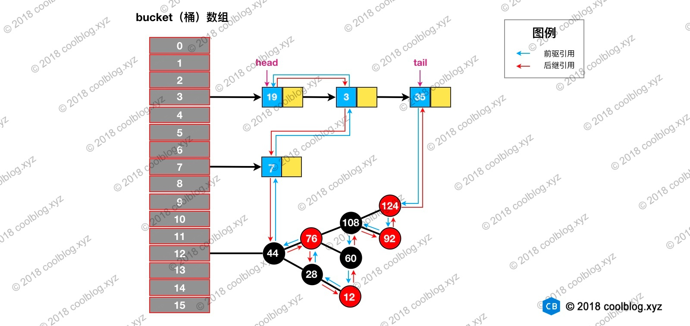

## Collection 接口下的集合

### List

* ArrayList  
  基于数组，非线程安全；  
  插入和删除元素的时间复杂度受元素位置的影响，在指定位置 i 插入和删除元素的话，集合中第 i 和第 i 个元素之后的 (n-i) 个元素都要执行向后位/向前移一位的操作；  
  支持快速随机访问；  
  ArrayList 的空间浪费主要体现在在 list 列表的结尾会预留一定的容量空间(待理解)； 
  通过无参构造函数初始化时，底层指定一个空数组，实际在第一次 add 元素时才会初始化。  
  <br>
  扩容：  
  JDK8中，以无参数构造方法创建 ArrayList 时，实际上初始化赋值的是一个空数组。当真正对数组进行添加元素操作时，才真正分配容量。即向数组中添加第一个元素时，数组容量扩为 10（优化了内存）。  
  初始容量大小 DEFAULT_CAPACITY = 10；  
  每次扩容为原来的1.5倍大小；  
  在 add 大量元素之前用 ensureCapacity 方法，以减少增量重新分配的次数;  
  trimToSize()，修剪 ArrayList，最小化 ArrayList 所占用的存储空间。  
  <br>
  System.arraycopy() 和 Arrays.copyOf()方法:  
  copyOf()内部实际调用了 System.arraycopy() 方法;  
  arraycopy() 需要目标数组，将原数组拷贝到你自己定义的数组里或者原数组，而且可以选择拷贝的起点和长度以及放入新数组中的位置 copyOf() 是系统自动在内部新建一个数组，并返回该数组。  
  <br>
* Vector  
  基于数组，古老实现，线程安全，不建议使用。  
  <br>
* LinkedList  
  基于双向链表，非线程安全；  
  如果是在头尾插入或者删除元素不受元素位置的影响，近似 O(1)，如果是要在指定位置 i 插入和删除元素的话， 时间复杂度近似为 O(n) ，因为需要先移动到指定位置再插入；  
  不支持快速随机访问；  
  LinkedList 的空间花费则体现在它的每一个元素都需要消耗比 ArrayList 更多的空间（因为要存放直接后继和直接前驱以及数据）；  
  访问头元素的方法：getFirst()，element()，peek()，peekFirst()，这四个获取头结点方法的区别在于对链表为空时的处理，是抛出异常还是返回 null，其中 getFirst() 和 element() 方法将会在链表为空时，抛出异常；  
  获取尾节点的方法：getLast()，peekLast()，  getLast() 方法在链表为空时，会抛出NoSuchElementException，而peekLast() 则不会，只是会返回 null；  
  删除头节点：remove(),removeFirst(),pop()，为空都会抛出NoSuchElementException；  
  删除尾节点：removeLast(),pollLast()，removeLast()在链表为空时将抛出NoSuchElementException，而pollLast()方法返回null；  

### Set

* HashSet  
  HashSet 的底层是 HashMap，线程不安全的，可以存储 null 值；  
  <br>
* LinkedHashSet  
  LinkedHashSet 是 HashSet 的子类，能够按照添加的顺序遍历；  
  <br>
* TreeSet  
  TreeSet 底层使用红黑树，能够按照添加元素的顺序进行遍历，排序的方式有自然排序和定制排序。

## Map 接口下的集合

### Map

* HashMap  
  非线程安全；  
  HashMap 可以存储 null 的 key 和 value，但 null 作为键只能有一个，null 作为值可以有多个；  
  HashMap 通过 key 的 hashCode 经过扰动函数处理过后得到 hash 值，然后通过 (n - 1) & hash 判断当前元素存放的位置（这里的 n 指的是数组的长度），如果当前位置存在元素的话，
  就判断该元素与要存入的元素的 hash 值以及 key 是否相同，如果相同的话，直接覆盖，不相同的话则通过相应方法解决冲突；      
  JDK1.8 之前 HashMap 由数组+链表组成的，数组是 HashMap 的主体，链表则是主要为了解决哈希冲突而存在的（“拉链法”解决冲突，新节点加在链表后面）；  
  JDK1.8 以后的 HashMap 在解决哈希冲突时有了较大的变化，当链表长度大于阈值（默认为 8）（将链表转换成红黑树前会判断，如果当前数组的长度小于
  64，那么会选择先进行数组扩容，而不是转换为红黑树）时，将链表转化为红黑树，以减少搜索时间（红黑树就是为了解决二叉查找树的缺陷，因为二叉查找树在某些情况下会退化成一个线性结构）；  
  HashMap 默认的初始化大小为 16。之后每次扩充，容量变为原来的 2 倍；   
  HashMap 指定初始容量的构造方法做的事情比较简单，一般都是初始化一些重要变量，比如 loadFactor 和 threshold。而对于给定的初始值会先将其扩展到2的幂次方，由tableSizeFor()
  方法保证（扩展到2的幂次方，能够提升通过hash值来计算数组下标时的效率）。而底层的数据结构则是延迟到插入键值对时再进行初始化；  
  进行扩容，会伴随着一次重新 hash 分配，并且会遍历 hash 表中所有的元素，是非常耗时的。在编写程序中，要尽量避免 resize；  
  <br>
  遍历方式：
    * 使用迭代器 EntrySet 的方式遍历；
    * 使用迭代器 KeySet 的方式遍历；
    * 使用 For Each EntrySet 的方式遍历；
    * 使用 For Each KeySet 的方式遍历；
    * 使用 lambda 的方式遍历；
    * 使用 Stream Api 的方式遍历；
    * 使用 Stream Api 并行的方式遍历。
      <br>
* LinkedHashMap   
  参考链接：<https://www.imooc.com/article/22931>  
  LinkedHashMap 继承自 HashMap，在 HashMap 基础上，通过维护一条双向链表，解决了 HashMap 不能随时保持遍历顺序和插入顺序一致的问题；  
    
  链表的建立过程：链表的建立过程是在插入键值对节点时开始的，初始情况下，让 LinkedHashMap 的 head 和 tail 引用同时指向新节点，链表就算建立起来了。随后不断有新节点插入，通过将新节点接在 tail
  引用指向节点的后面，即可实现链表的更新（访问时从头到位遍历链表访问）；  
  访问顺序的维护过程：默认情况下，LinkedHashMap 是按插入顺序维护链表。不过我们可以在初始化 LinkedHashMap，指定 accessOrder 参数为 true，即可让它按访问顺序维护链表。原理是当我们调用
  get/getOrDefault/replace 等方法时，只需要将这些方法访问的节点移动到链表的尾部；  
  基于 LinkedHashMap 实现 LRU 策略缓存：
  ```java
  void afterNodeInsertion(boolean evict) { // possibly remove eldest
      LinkedHashMap.Entry<K,V> first;
      // 根据条件判断是否移除最近最少被访问的节点
      if (evict && (first = head) != null && removeEldestEntry(first)) {
          K key = first.key;
          removeNode(hash(key), key, null, false, true);
      }
  }

  // 移除最近最少被访问条件之一，通过覆盖此方法可实现不同策略的缓存
  protected boolean removeEldestEntry(Map.Entry<K,V> eldest) {
      return false;
  }
  ```  
  当我们基于 LinkedHashMap 实现缓存时，通过覆写 removeEldestEntry 方法可以实现自定义策略的 LRU
  缓存。比如我们可以根据节点数量判断是否移除最近最少被访问的节点，或者根据节点的存活时间判断是否移除该节点等;   
  实现代码如下：
  ```java
  public class SimpleCache<K, V> extends LinkedHashMap<K, V> {

      private static final int MAX_NODE_NUM = 100;
  
      private int limit;
  
      public SimpleCache() {
          this(MAX_NODE_NUM);
      }
  
      public SimpleCache(int limit) {
          super(limit, 0.75f, true);
          this.limit = limit;
      }
  
      public V save(K key, V val) {
          return put(key, val);
      }
  
      public V getOne(K key) {
          return get(key);
      }
  
      public boolean exists(K key) {
          return containsKey(key);
      }
  
      /**
       * 判断节点数是否超限
       * @param eldest
       * @return 超限返回 true，否则返回 false
       */
      @Override
      protected boolean removeEldestEntry(Map.Entry<K, V> eldest) {
          return size() > limit;
      }
  }
  ```
* HashTable  
  线程安全，因为 HashTable 内部的方法基本都经过 synchronized 修饰；  
  因为线程安全问题，效率低一些，另外，HashTable 基本被淘汰，不要在代码中使用它；  
  HashTable 不允许有 null 键和 null 值，否则会抛出 NullPointerException；  
  <br>
* TreeMap  
  可以自定义排序；  
  <br>
* ConcurrentHashMap  
  线程安全，JDK1.7采用 Segment 分段锁，到了 JDK1.8 的时候已经摒弃了 Segment 的概念，而是直接用 Node 数组+链表+红黑树的数据结构来实现，并发控制使用 synchronized 和 CAS 
  来操作，相较于 HashTable 使用 synchronized 加同一把锁来保证线程安全，更加高效；  
  <br>
  
  Java 7 中 ConcurrentHashMap 的存储结构如上图，ConcurrnetHashMap 由很多个 Segment 组合，而每一个 Segment 是一个类似于 HashMap 的结构，所以每一个 HashMap 的内部可以进行扩容。但是 Segment 的个数一旦初始化就不能改变，默认 Segment 的个数是 16 个，你也可以认为 ConcurrentHashMap 默认支持最多 16 个线程并发；
  
  JDK1.8中，大部分都是CAS操作，加锁的部分是对桶的头节点进行加锁，锁粒度很小。
    
## 补充

* RandomAccess 接口
  ```java
  public interface RandomAccess {
  }
  ```
  RandomAccess 接口只是标识，标识实现这个接口的类具有随机访问功能。ArrayList 实现了 RandomAccess 接口， 而 LinkedList 没有实现（和他们的底层数据结构有关，并不是说 ArrayList 实现
  RandomAccess 接口才具有快速随机访问功能的！）。  
  <br>
* 排序 实现 Comparable 接口 compareTo(Object obj) 方法（修改比较项的源码）；  
  实现 comparator 接口 compare (Object obj1, Object obj2) 方法（作为排序参数传递）。
  
  

