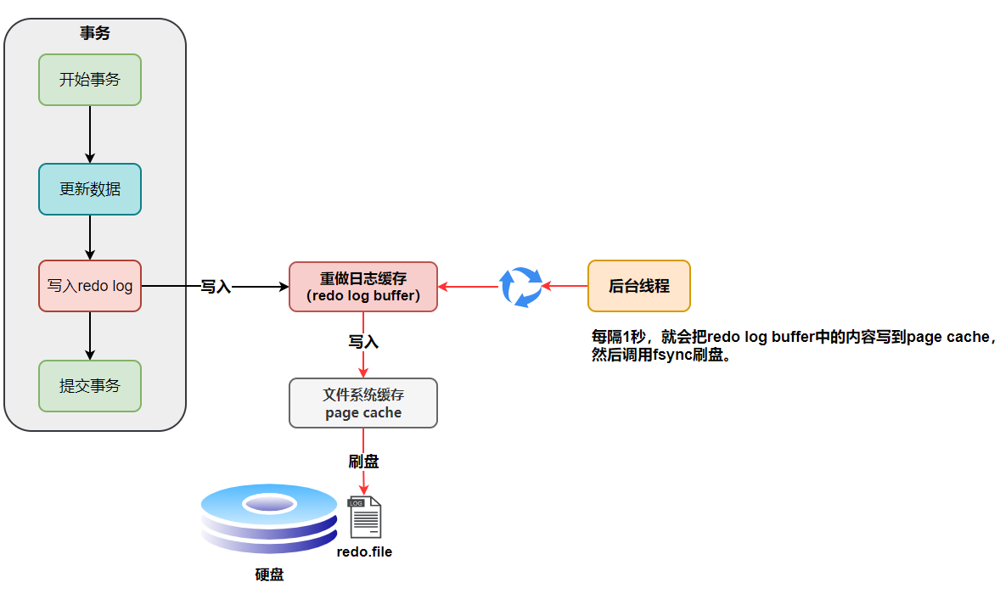
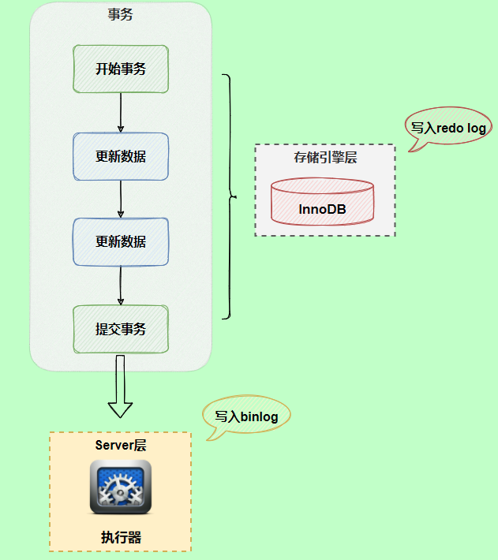
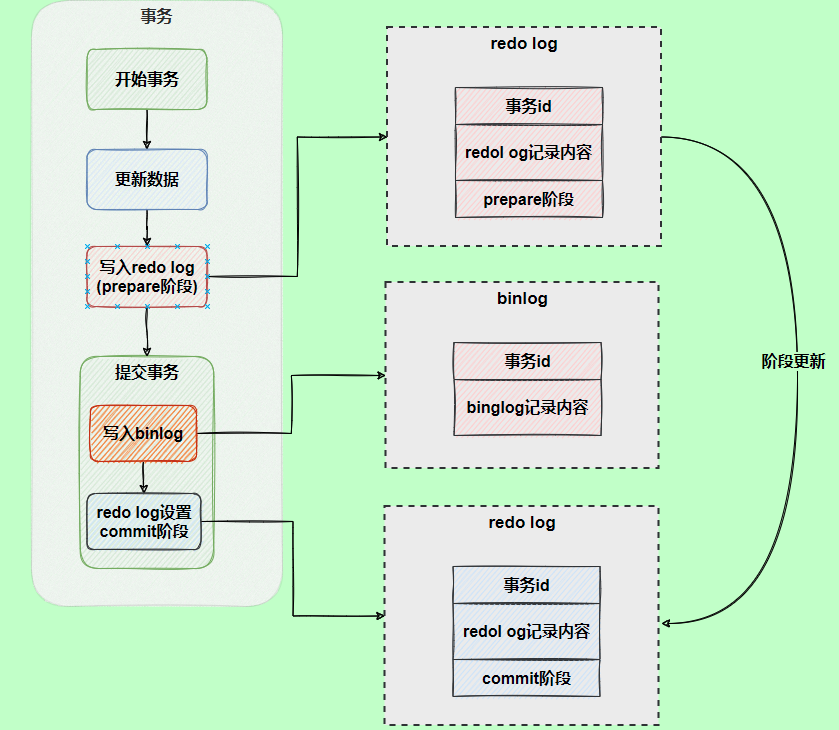
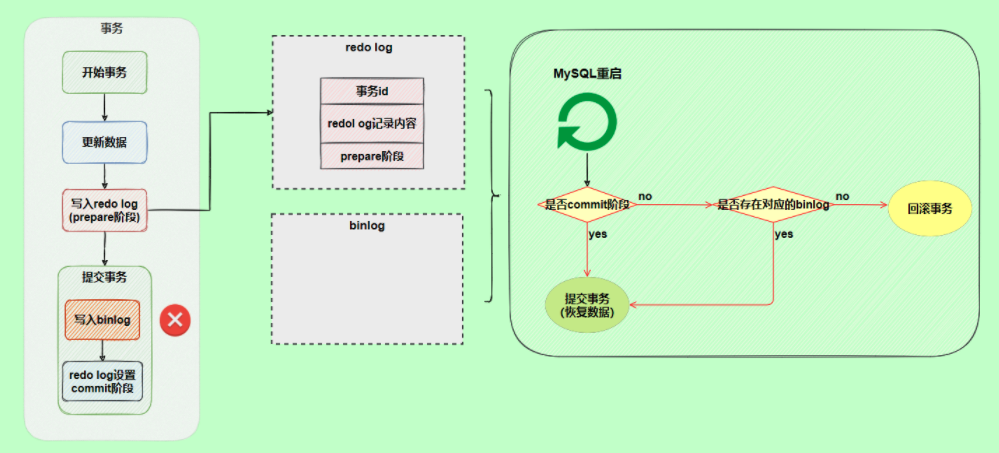
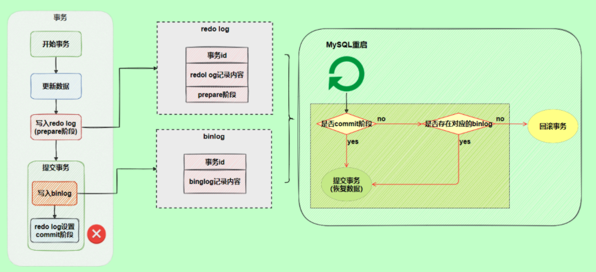

## undo log

想要保证事务的原子性，就需要在异常发生时，对已经执行的操作进行回滚。而在 MySQL 中，恢复机制是通过回滚日志（undo log）实现的，所有事务进行的修改都会先记录到这个回滚日志中，然后才对数据库中的数据执行修改操作。

回滚日志会先于数据持久化到磁盘上。这样就保证了即使遇到数据库突然宕机等情况，当用户再次启动数据库的时候，数据库还能够通过查询回滚日志来回滚将之前未完成的事务。

## redo log

redo log（重做日志）是 InnoDB 存储引擎独有的，它让 MySQL 拥有了崩溃恢复能力。

InnoDB 作为 MySQL 的存储引擎，数据是存放在磁盘中的，但如果每次读写数据都需要磁盘 IO，效率会很低。为此，InnoDB 提供了缓存(Buffer Pool)，Buffer Pool 中包含了磁盘中部分数据页的映射，作为访问数据库的缓冲：
当从数据库读取数据时，会首先从 Buffer Pool 中读取，如果 Buffer Pool 中没有，则从磁盘读取后放入 Buffer Pool；当向数据库写入数据时，会首先写入 Buffer Pool，Buffer Pool 中修改的数据会定期刷新到磁盘中（这一过程称为刷脏）。

Buffer Pool 的使用大大提高了读写数据的效率，但是也带了新的问题：如果 MySQL 宕机，而此时 Buffer Pool 中修改的数据还没有刷新到磁盘，就会导致数据的丢失，事务的持久性无法保证。

于是，redo log 被引入来解决这个问题：当数据修改时，除了修改 Buffer Pool 中的数据，还会在 redo log 记录这次操作；当事务提交时，会调用 fsync 接口对 redo log 进行刷盘。如果 MySQL 宕机，重启时可以读取 redo log 中的数据，对数据库进行恢复。
redo log 采用的是 WAL（Write-ahead logging，预写式日志），所有修改先写入日志，再更新到 Buffer Pool，保证了数据不会因 MySQL 宕机而丢失，从而满足了持久性要求。

引入 Buffer Pool 是为了减少磁盘读写频率，提高读写效率。引入 redo log 是为了避免宕机时 Buffer Pool 的数据丢失。记录 redo log 
也是对磁盘的写入为，何引入不会造成效率降低，或者说为什么它比直接将 Buffer Pool 中修改的数据写入磁盘(即刷脏)要快呢？
主要有以下两方面的原因：

* 刷脏是随机 IO，因为每次修改的数据位置随机，但写 redo log 是追加操作，属于顺序 IO；
* 刷脏是以数据页（Page）为单位的，MySQL 默认页大小是 16KB，一个 Page 上一个小修改都要整页写入；而 redo log 中只包含真正需要写入的部分，无效 IO 大大减少。

## binlog

MySQL 数据库的数据备份、主备、主主、主从都离不开 binlog，需要依靠 binlog 来同步数据，保证数据一致性。

binlog 的写入时机非常简单，事务执行过程中，先把日志写到 binlog cache，事务提交的时候，再把 binlog cache 写到 binlog 文件中。

## redo log 与 binlog 对比

* 作用不同：redo log 是用于 crash recovery 的，保证 MySQ L宕机也不会影响持久性；binlog 是用于 point-in-time recovery 的，保证服务器可以基于时间点恢复数据，此外 binlog 还用于主从复制;
* 层次不同：redo log 是 InnoDB 存储引擎实现的，而 binlog 是 MySQL 的服务器层实现的，同时支持 InnoDB 和其他存储引擎；
* 内容不同：redo log 是物理日志，内容基于磁盘的 Page；binlog 的内容是二进制的，根据 binlog_format 参数的不同，可能基于 sql 语句、基于数据本身或者二者的混合。

redo log (重做日志)让 InnoDB 存储引擎有了崩溃恢复能力（通过预写，保证只要事务提交，redo log 一定会记录日志）。binlog（归档日志）保证了 MySQL 集群架构的数据一致性。

#### 两阶段提交

在执行更新语句过程，会记录 redo log 与 binlog 两块日志，以基本的事务为单位，redo log 在事务执行过程中可以不断写入，而 binlog 只有在提交事务时才写入，
所以 redo log 与 binlog 的写入时机不一样。

以 update 语句为例，假设 id=2 的记录，字段 c 值是 0，把字段 c 值更新成 1，SQL 语句为 update T set c=1 where id=2。假设执行过程中写完redo 
log日志后，binlog 日志写期间发生了异常，就会出现 redo log 和 binlog 不一致的问题。为了解决两份日志之间的逻辑一致问题，InnoDB 存储引擎使用两阶段提交方案。
原理很简单，将 redo log 的写入拆成了两个步骤 prepare 和 commit，这就是两阶段提交。

使用两阶段提交后，写入 binlog 时发生异常也不会有影响，因为 MySQL 根据 redo log 日志恢复数据时，发现 redo log 还处于 prepare 阶段，并且没有对应 binlog 日志，就会回滚该事务。

那么，redo log 设置 commit 阶段发生异常，那会不会回滚事务呢？

并不会回滚事务，它会执行上图框住的逻辑，虽然 redo log 是处于 prepare 阶段，但是能通过事务 id 找到对应的 binlog 日志，所以 MySQL 认为是完整的，就会提交事务恢复数据。

## 总结

MySQL InnoDB 引擎使用 redo log(重做日志) 保证事务的持久性，使用 undo log(回滚日志) 来保证事务的原子性。

MySQL 数据库的数据备份、主备、主主、主从都离不开 binlog，需要依靠 binlog 来同步数据，保证数据一致性。

## 参考文章

* [MySQL数据库事务，锁和MVCC](https://www.jianshu.com/p/ad879487a571)
* [MySQL三大日志](https://github.com/Snailclimb/JavaGuide/blob/master/docs/database/mysql/MySQL%E4%B8%89%E5%A4%A7%E6%97%A5%E5%BF%97.md)