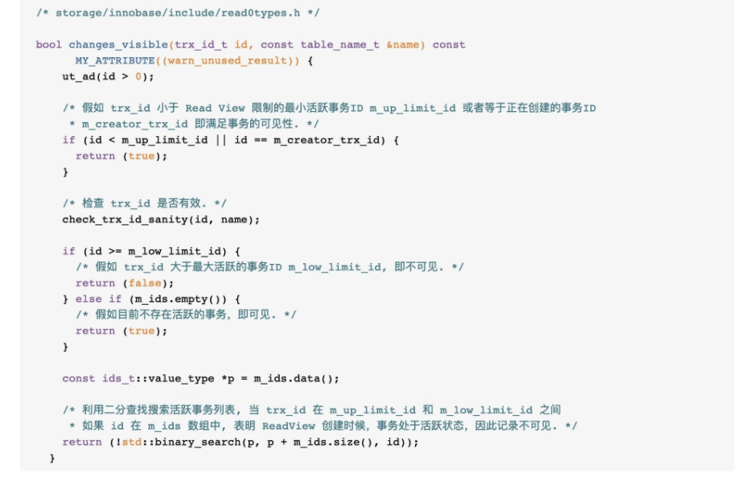

## 锁类型

#### 乐观锁和悲观锁

数据库锁从逻辑角度可以分为两类：乐观锁和悲观锁。

###### 悲观锁

悲观锁一般就是我们通常说的数据库层面的锁机制。一般分为表锁和行锁。MyISAM 中只用到表锁，不会有死锁的问题，锁的开销也很小，但是相应的并发能力很差。InnoDB 实现了行级锁和表锁，
锁的粒度变小了，并发能力变强，但是相应的锁的开销变大，很有可能出现死锁。同时 InnoDB 需要协调这两种锁，算法也变得复杂。

悲观锁按使用性质分类：

* 共享锁（S 锁）：假设事务 T1 对数据 A 加上共享锁，那么事务 T2 可以读数据 A，不能修改数据 A；
* 排他锁（X 锁）：假设事务 T1 对数据A加上共享锁，那么事务 T2 不能读数据 A，不能修改数据 A。

悲观锁按作用范围分类：

* 行锁
* 表锁

InnoDB 的行锁算法主要包括以下三种：

* Record Locks：行锁，注意了，该锁是对索引记录进行加锁！锁是在加索引上而不是行上的。注意了，InnoDB 一定存在聚簇索引，因此行锁最终都会落到聚簇索引上！
* Gap Locks：间隙锁，是对索引的间隙加锁，其目的只有一个，防止其他事物插入数据。在 RC 隔离级别下，不会使用间隙锁。这里我对官网补充一下，隔离级别比 RC 低的情况下，也不会使用间隙锁， 如隔离级别为 RU
  时，也不存在间隙锁。当隔离级别为 RR 和 Serializable 时，就会存在间隙锁。
* Next-Key Locks：这个理解为 Record Lock +索引前面的 Gap Lock。

InnoDB 行锁是通过给索引上的索引项加锁来实现的，这一点 MySQL 与 Oracle 不同，后者是通过在数据块中对相应数据行加锁来实现的。 InnoDB 这种行锁实现特点意味着：只有通过索引条件检索数据， InnoDB
才使用行级锁，否则，InnoDB 将使用表锁！

**上面这句话有两个注意点：**

1. 并不是用表锁来实现锁表的操作，而是利用了 Next-Key Locks，也可以理解为是用了行锁+间隙锁来实现锁表的操作!
2. 注意我上面说的，之所以能够锁表，是通过行锁+间隙锁来实现的。那么，RU 和 RC 都不存在间隙锁，所以上面这种说法在 RU 和 RC 中是不能成立的。因此，该说法只在 RR 和 Serializable 中是成立的。 如果隔离级别为
   RU 和 RC，无论条件列上是否有索引，都不会锁表，只锁行！

###### 乐观锁

相对悲观锁而言，乐观锁机制采取了更加宽松的加锁机制。悲观锁大多数情况下依靠数据库的锁机制实现，以保证操作最大程度的独占性。但随之而来的就是数据库性能的大量开销，特别是对长事务而言，这样的开销往往无法承受。

而乐观锁机制在一定程度上解决了这个问题。乐观锁，大多是基于数据版本（ Version ）记录机制实现。何谓数据版本？即为数据增加一个版本标识，在基于数据库表的版本解决方案中，一般是通过为数据库表增加一个 “version” 字段来实现。
读取出数据时，将此版本号一同读出，之后更新时，对此版本号加一。此时，将提交数据的版本数据与数据库表对应记录的当前版本信息进行比对，如果提交的数据版本号大于数据库表当前版本号，则予以更新，否则认为是过期数据。

MVCC 机制是乐观锁的实现。要说明的是，MVCC 的实现没有固定的规范，每个数据库都会有不同的实现方式。

## MVCC 机制

MySQL MVCC 机制实现了 Read committed 和 Repeatable Read 隔离级别。如果要实现 Read committed 隔离级别，最简单的方案就是给事务中所有的读操作添加共享锁，所有的写操作添加排他锁。
这样就能够确保所有事务内的读操作都能够读到已经提交了的更新（未提交的更新加了排他锁，因此无法读到）。

然而直接通过读锁和排他锁实现的 Read committed 隔离级别，并发事务读吞吐量很低。因此，MySQL 通过 MVCC 机制，避免了对于读操作的加锁，并发竞争的概率大大降低，从而提升了并发事务间的读效率。

#### 一致性非锁定读

对于 一致性非锁定读（Consistent Nonlocking Reads） 的实现，通常做法是加一个版本号或者时间戳字段，在更新数据的同时版本号 + 1 或者更新时间戳。查询时，将当前可见的版本号与对应记录的版本号进行比对，
如果记录的版本小于可见版本，则表示该记录可见。

在 InnoDB 存储引擎中，多版本控制 (multi versioning) 就是对非锁定读的实现。如果读取的行正在执行 DELETE 或 UPDATE 操作，这时读取操作不会去等待行上锁的释放。 相反地，InnoDB
存储引擎会去读取行的一个快照数据，对于这种读取历史数据的方式，我们叫它快照读 (snapshot read)。真是由于这种快照读才使得 DELETE 或 UPDATE 操作无需等待锁的释放，可以直接操作行。

在 Repeatable Read 和 Read Committed 两个隔离级别下，如果是执行普通的 select 语句（不包括 select ... lock in share mode ,select ... for
update）则会使用一致性非锁定读（MVCC）。 并且在 Repeatable Read 下 MVCC 实现了可重复读和防止部分幻读。

#### 锁定读

如果执行的是下列语句，就是 锁定读（Locking Reads）

* select ... lock in share mode
* select ... for update
* insert、update、delete 操作

在锁定读下，读取的是数据的最新版本，这种读也被称为当前读（current read）。锁定读会对读取到的记录加锁：

* select ... lock in share mode：对记录加 S 锁，其它事务也可以加 S 锁，如果加 x 锁则会被阻塞
* select ... for update、insert、update、delete：对记录加 X 锁，且其它事务不能加任何锁

#### MVCC 实现原理

MVCC 的实现没有固定的规范，这里讨论的是 InnoDB 对 MVCC 的实现。

MVCC 的实现依赖于：隐藏字段、Read View、undo log。在内部实现中，InnoDB 通过数据行的 DB_TRX_ID 和 Read View 来判断数据的可见性，如不可见，则通过数据行的 DB_ROLL_PTR 找到
undo log 中的历史版本。

###### 隐藏字段

在内部，InnoDB 存储引擎为每行数据添加了三个隐藏字段：

* DB_TRX_ID：表示最后一次插入或更新该行的事务 id。此外，delete 操作在内部被视为更新，只不过会将记录头 Record header 中的 deleted_flag 字段标记为已删除
* DB_ROLL_PTR： 回滚指针，指向该行的 undo log 。如果该行未被更新，则为空
* DB_ROW_ID：如果没有设置主键且该表没有唯一非空索引时，InnoDB 会使用该 id 来生成聚簇索引

###### Read View

Read View 主要是用来做可见性判断，里面保存了 “当前对本事务不可见的其他活跃事务”。

主要有以下字段：

* m_low_limit_id：目前出现过的最大的事务 ID+1，即下一个将被分配的事务 ID。大于这个 ID 的数据版本均不可见
* m_up_limit_id：活跃事务列表 m_ids 中最小的事务 ID，如果 m_ids 为空，则 m_up_limit_id 为 m_low_limit_id。小于这个 ID 的数据版本均可见
* m_ids：Read View 创建时其他未提交的活跃事务 ID 列表。创建 Read View 时，将当前未提交事务 ID 记录下来，后续即使它们修改了记录行的值，对于当前事务也是不可见的。m_ids
  不包括当前事务自己和已提交的事务（正在内存中）
* m_creator_trx_id：创建该 Read View 的事务 ID

###### 数据可见性算法

执行 Select 语句时，MVCC 机制会根据每一条数据的 DB_TRX_ID 和当前事务的 ReadView，来决定是否展示改行数据，具体流程如下：



1. 如果记录 DB_TRX_ID < m_up_limit_id，那么表明最新修改该行的事务（DB_TRX_ID）在当前事务创建快照之前就提交了，所以该记录行的值对当前事务是可见的；
2. 如果 DB_TRX_ID >= m_low_limit_id，那么表明最新修改该行的事务（DB_TRX_ID）在当前事务创建快照之后才修改该行，所以该记录行的值对当前事务不可见。跳到步骤 5;
3. 如果 m_up_limit_id <= DB_TRX_ID < m_up_limit_id，表明最新修改该行的事务（DB_TRX_ID）在当前事务创建快照的时候可能处于“活动状态”或者“已提交状态”。所以就要对活跃事务列表 m_ids
   进行查找（源码中是用的二分查找，因为是有序的。另外，如果该行数据事务 ID 等于 creator_trx_id，这说明该数据就是当前事务修改的，因此也可以直接展示）
    * 如果在活跃事务列表 m_ids 中能找到 DB_TRX_ID，表明在当前事务创建快照前，该记录行的值被事务 ID 为 DB_TRX_ID 的事务修改了，但没有提交，这种情况下，这个记录行的值对当前事务都是不可见的，跳到步骤 4；
    * 在活跃事务列表中找不到，则表明“id 为 trx_id 的事务”在修改“该记录行的值”后，在“当前事务”创建快照前就已经提交了，所以记录行对当前事务可见。
4. 在该记录行的 DB_ROLL_PTR 指针所指向的 undo log 取出快照记录，用快照记录的 DB_TRX_ID 跳到步骤 1 重新开始判断，直到找到满足的快照版本或返回空。

#### RC 和 RR 隔离级别下 MVCC 的差异

在事务隔离级别 RC 和 RR （InnoDB 存储引擎的默认事务隔离级别）下，InnoDB 存储引擎使用 MVCC（非锁定一致性读），但它们生成 Read View 的时机却不同：

* 在 RC 隔离级别下的 每次 select 查询前都生成一个 Read View (m_ids 列表)，所以导致不可重复读；
* 在 RR 隔离级别下只在事务开始后第一次 select 数据前生成一个Read View（m_ids 列表），之后同一个事务内所有的 select 语句都会使用这个 Read View。

另外，MVCC 在更新每行数据时（更新 DB_TRX_ID 和 DB_ROLL_PTR 属性），都会使用排他锁来进行更新。

#### 关于当前读和快照读

在 RC 和 RR 隔离级别下，不显式加 lock in share mode 与 for update 的 select 操作都属于快照读，使用 MVCC，因此，如果想要在一个数据库事务中读取到最新的数据， 要么将隔离级别设置为
RC，要么使用加锁读（即当前读）的方式。

RR 隔离级别下为什么读不到最新的数据？这与 undo log 有关。  
undo log 的作用有两个：

* 当事务回滚时用于将数据恢复到修改前的样子
* 另一个作用是 MVCC ，当读取记录时，若该记录被其他事务占用或当前版本对该事务不可见，则可以通过 undo log 读取之前的版本数据，以此实现非锁定读

RR 隔离级别下，快照读一个事务中多次 select 也只会开启一个 Read View，即使在多次 select 之间有新的事务提交，新事务的 DB_TRX_ID 也会大于该 Read View 的 m_low_limit_id
，从而该记录行的值对当前事务不可见，会去到 undo log 中找该记录行的之前的快照记录。

RC 和当前读能读到最新数据是因为，RC 隔离级别下每一个 select 都会新开启一个 Read View，新提交的事务在下一次 select 开始 Read View 时都能感知到。而当前读会对读的数据加锁，如果读的数据正在别的事务中，
则会一直阻塞，直到该事务结束，所以读到的必定时最新的数据。

在 InnoDB 存储引擎中 undo log 分为两种： insert undo log 和 update undo log

* insert undo log ：指在 insert 操作中产生的 undo log。因为 insert 操作的记录只对事务本身可见，对其他事务不可见，故该 undo log 可以在事务提交后直接删除。不需要进行 purge 操作；
* update undo log ：update 或 delete 操作中产生的 undo log。该 undo log可能需要提供 MVCC 机制，因此不能在事务提交时就进行删除。提交时放入 undo log 链表，等待 purge线程
  进行最后的删除。

不同事务或者相同事务的对同一记录行的修改，会使该记录行的 undo log 成为一条链表，链首就是最新的记录，链尾就是最早的旧记录。

## 再谈数据库锁

判断一条 select 语句的加锁方式，需要注意三个点：

* 当前查询语句所在事务的隔离级别；
* 查询列是否存在索引；
* 如果存在索引是聚簇索引还是非聚簇索引。

#### 分析

假设有表如下，pId 为主键索引:

| pId(int) | name(varchar) | num(int) | 
| :-----| :---- | :---- |
| 1 | aaa | 100 | 
| 2 | bbb | 200 | 
| 3 | bbb | 300 |
| 7 | ccc | 200 |

###### RC/RU + 条件列非索引

```sql
select *
from table
where num = 200
```

不加任何锁，是快照读

```sql
select *
from table
where num > 200
```

不加任何锁，是快照读

```sql
select *
from table
where num = 200 lock in share mode
```

当 num = 200，有两条记录。这两条记录对应的 pId = 2，7，因此在 pId = 2，7 的聚簇索引上加行级 S 锁，采用当前读

```sql
select *
from table
where num > 200 lock in share mode
```

当 num > 200，有一条记录。这条记录对应的 pId = 3，因此在 pId = 3 的聚簇索引上加上行级 S 锁，采用当前读

```sql
select *
from table
where num = 200 for update
```

当 num = 200，有两条记录。这两条记录对应的 pId = 2，7，因此在 pId = 2，7 的聚簇索引上加行级 X 锁，采用当前读

```sql
select *
from table
where num > 200 for update
```

当 num > 200，有一条记录。这条记录对应的 pId = 3，因此在 pId = 3 的聚簇索引上加上行级X锁，采用当前读

###### RC/RU + 条件列是聚簇索引

pId 使用聚簇索引，此情况和 RC/RU + 条件列非索引类似

```sql
select *
from table
where pId = 2
```

不加任何锁，是快照读

```sql
select *
from table
where pId > 2
```

不加任何锁，是快照读

```sql
select *
from table
where pId = 2 lock in share mode
```

在 pId = 2 的聚簇索引上，加 S 锁，为当前读

```sql
select *
from table
where pId > 2 lock in share mode
```

在 pId = 3，7 的聚簇索引上，加 S 锁，为当前读

```sql
select *
from table
where pId = 2 for update
```

在 pId = 2 的聚簇索引上，加 X 锁，为当前读

```sql
select *
from table
where pId > 2 for update
```

在 pId = 3，7 的聚簇索引上，加 X 锁，为当前读

**为什么条件列加不加索引，加锁情况是一样的？**

当 sql 运行的过程中，MySQL 并不知道哪些数据行是 num = 200 的（没有索引嘛），如果一个条件无法通过索引快速过滤，存储引擎层面就会将所有记录加锁后返回，再由 MySQL Server 层进行过滤。 在 MySQL
Server 过滤条件，发现不满足后，会调用 unlock_row 方法，把不满足条件的记录释放锁。这样做，保证了最后只会持有满足条件记录上的锁，但是每条记录的加锁操作还是不能省略的。 因此你看起来最终结果是一样的。但是 RC/RU
+条件列非索引比本例多了一个释放不符合条件的锁的过程！

###### RC/RU + 条件列是非聚簇索引

我们在 num 列上建上非唯一索引。此时有一棵聚簇索引(主键索引，pId)形成的 B+ 索引树，其叶子节点为硬盘上的真实数据。以及另一棵非聚簇索引(非唯一索引，num)
形成的 B+ 索引树，其叶子节点依然为索引节点，保存了 num 列的字段值，和对应的聚簇索引。

```sql
select *
from table
where num = 200
```

不加任何锁，是快照读

```sql
select *
from table
where num > 200
```

不加任何锁，是快照读

```sql
select *
from table
where num = 200 lock in share mode
```

当 num = 200，由于 num 列上有索引，因此先在 num = 200 的两条索引记录上加行级S锁。接着，去聚簇索引树上查询，这两条记录对应的 pId = 2，7，因此在 pId = 2，7 的聚簇索引上加行级 S 锁，采用当前读。

```sql
select *
from table
where num > 200 lock in share mode
```

当 num > 200，由于 num 列上有索引，因此先在符合条件的 num = 300 的一条索引记录上加行级 S 锁。接着，去聚簇索引树上查询，这条记录对应的 pId = 3，因此在 pId = 3 的聚簇索引上加行级 S
锁，采用当前读。

```sql
select *
from table
where num = 200 for update
```

当 num = 200，由于 num 列上有索引，因此先在 num = 200 的两条索引记录上加行级 X 锁。接着，去聚簇索引树上查询，这两条记录对应的 pId = 2，7，因此在 pId = 2，7 的聚簇索引上加行级 X
锁，采用当前读。

```sql
select *
from table
where num > 200 for update
```

当 num > 200，由于 num 列上有索引，因此先在符合条件的 num = 300 的一条索引记录上加行级 X 锁。接着，去聚簇索引树上查询，这条记录对应的 pId = 3，因此在 pId = 3 的聚簇索引上加行级 X
锁，采用当前读。

###### RR/Serializable + 条件列非索引

RR 级别需要多考虑的就是 gap lock，他的加锁特征在于，在非索引条件下无论你怎么查都是锁全表。

```sql
select *
from table
where num = 200
```

在 RR 级别下，不加任何锁，是快照读。

在 Serializable 级别下，在 pId = 1,2,3,7（全表所有记录）的聚簇索引上加 S 锁。并且在聚簇索引的所有间隙(-∞,1)(1,2)(2,3)(3,7)(7,+∞)加 gap lock。

```sql
select *
from table
where num > 200
```

在RR级别下，不加任何锁，是快照读。

在 Serializable 级别下，在 pId = 1,2,3,7（全表所有记录）的聚簇索引上加 S 锁。并且在聚簇索引的所有间隙(-∞,1)(1,2)(2,3)(3,7)(7,+∞)加 gap lock。

```sql
select *
from table
where num = 200 lock in share mode
```

在 pId = 1,2,3,7（全表所有记录）的聚簇索引上加 S 锁。并且在聚簇索引的所有间隙(-∞,1)(1,2)(2,3)(3,7)(7,+∞)加 gap lock。

```sql
select *
from table
where num > 200 lock in share mode
```

在 pId = 1,2,3,7（全表所有记录）的聚簇索引上加 S 锁。并且在聚簇索引的所有间隙(-∞,1)(1,2)(2,3)(3,7)(7,+∞)加 gap lock。

```sql
select *
from table
where num = 200 for update
```

在 pId = 1,2,3,7（全表所有记录）的聚簇索引上加 X 锁。并且在聚簇索引的所有间隙(-∞,1)(1,2)(2,3)(3,7)(7,+∞)加 gap lock。

```sql
select *
from table
where num > 200 for update
```

在 pId = 1,2,3,7（全表所有记录）的聚簇索引上加 X 锁。并且在聚簇索引的所有间隙(-∞,1)(1,2)(2,3)(3,7)(7,+∞)加 gap lock。

###### RR/Serializable + 条件列是聚簇索引

pId 用的就是聚簇索引。该情况的加锁特征在于，如果 where 后的条件为精确查询(= 的情况)，那么只存在 record lock。如果 where 后的条件为范围查询(> 或 < 的情况)，那么存在的是 record lock +
gap lock。

```sql
select *
from table
where pId = 2
```

在 RR 级别下，不加任何锁，是快照读。

在 Serializable 级别下，是当前读，在 pId = 2 的聚簇索引上加 S 锁，不存在 gap lock。

```sql
select *
from table
where pId > 2
```

在 RR 级别下，不加任何锁，是快照读。

在 Serializable 级别下，是当前读，在 pId = 3,7 的聚簇索引上加 S 锁。在(2,3)(3,7)(7,+∞)加上 gap lock。

```sql
select *
from table
where pId = 2 lock in share mode
```

是当前读，在 pId = 2 的聚簇索引上加 S 锁，不存在 gap lock。

```sql
select *
from table
where pId > 2 lock in share mode
```

是当前读，在 pId = 3,7 的聚簇索引上加 S 锁。在(2,3)(3,7)(7,+∞)加上 gap lock。

```sql
select *
from table
where pId = 2 for update
```

是当前读，在 pId = 2 的聚簇索引上加 X 锁。

```sql
select *
from table
where pId > 2 for update
```

在 pId = 3,7 的聚簇索引上加 X 锁。在(2,3)(3,7)(7,+∞)加上 gap lock。

```sql
select *
from table
where pId = 6 [lock in share mode|for
update]
```

注意了，pId = 6 是不存在的列，这种情况会在(3,7)上加 gap lock。

```sql
select *
from table
where pId > 18 [lock in share mode|for
update]
```

注意了，pId > 18，查询结果是空的。在这种情况下，是在(7,+∞)上加 gap lock。

###### RR/Serializable + 条件列是非聚簇索引

这里非聚簇索引，需要区分是否为唯一索引。因为如果是非唯一索引，间隙锁的加锁方式是有区别的。先说一下，唯一索引的情况。如果是唯一索引，情况和 RR/Serializable + 条件列是聚簇索引类似，唯一有区别的是:这个时候有两棵索引树，
加锁是加在对应的非聚簇索引树和聚簇索引树上！大家可以自行推敲!

下面说一下，非聚簇索引是非唯一索引的情况，他和唯一索引的区别就是通过索引进行精确查询以后，不仅存在 record lock，还存在 gap lock。而通过唯一索引进行精确查询后，只存在 record lock，不存在 gap lock。
老规矩在 num 列建立非唯一索引。

RC/RU 隔离级别下条件列时非聚簇索引时，索引是不是唯一索引都无所谓，因为在该隔离界别下不存在 gap lock。

```sql
select *
from table
where num = 200
```

在 RR 级别下，不加任何锁，是快照读。

在 Serializable 级别下，是当前读，在 pId=2，7 的聚簇索引上加 S 锁，在 num = 200 的非聚集索引上加 S 锁，在(100,200)(200,300)加上 gap lock。

```sql
select *
from table
where num > 200
```

在RR级别下，不加任何锁，是快照读。

在 Serializable 级别下，是当前读，在 pId = 3 的聚簇索引上加 S 锁，在 num = 300 的非聚集索引上加S锁。在(200,300)(300,+∞)加上 gap lock。

```sql
select *
from table
where num = 200 lock in share mode
```

是当前读，在 pId = 2，7 的聚簇索引上加 S 锁，在 num = 20 0的非聚集索引上加 S 锁，在(100,200)(200,300)加上 gap lock。

```sql
select *
from table
where num > 200 lock in share mode
```

是当前读，在 pId = 3 的聚簇索引上加 S 锁，在 num = 300 的非聚集索引上加 S 锁。在(200,300)(300,+∞)加上 gap lock。

```sql
select *
from table
where num = 200 for update
```

是当前读，在 pId = 2，7 的聚簇索引上加 S 锁，在 num = 200 的非聚集索引上加 X 锁，在(100,200)(200,300)加上 gap lock。

```sql
select *
from table
where num > 200 for update
```

是当前读，在 pId = 3 的聚簇索引上加 S 锁，在 num = 300 的非聚集索引上加X锁。在(200,300)(300,+∞)加上 gap lock。

```sql
select *
from table
where num = 250 [lock in share mode|for
update]
```

注意了，num = 250 是不存在的列，这种情况会在(200,300)上加 gap lock。

```sql
select *
from table
where num > 400 [lock in share mode|for
update]
```

注意了，pId > 400，查询结果是空的。在这种情况下，是在(400,+∞)上加 gap lock。

## MySQL 在 RR 级别解决幻读了吗？

MySQL 没有完全解决快照读下的幻读问题。

可以做这个实验：

1. 当前 DB 已有 id 5, 10, 15 三条数据；
2. 事务 A 查询 id < 10 的数据，可以查出一行记录 id = 5；
3. 事务 B 插入 id = 6 的数据；
4. 事务 A 再查询 id < 10 的数据，可以查出一行记录 id = 5，查不出 id = 6 的数据（读场景，解决了幻读）；
5. 事务 A 可以更新/删除 id = 6 的数据，不能插入 id = 6 的数据（写场景，幻读不彻底）。

这个很好理解，MySQL 虽然通过 MVCC 的版本号来解决了读场景下的幻读，但对于上面第 5 步那种写场景的情况，其实是无能为力的，因为 MVCC 毕竟是无锁实现。

所以如果后续要对数据进行写操作，还是通过 for update 语句上锁比较稳妥，不然就可能会出现上面第 5 步那样的问题。

## 参考文章

* [MySQL数据库事务，锁和MVCC](https://www.jianshu.com/p/ad879487a571)
* [【原创】惊！史上最全的select加锁分析(Mysql)](https://www.cnblogs.com/rjzheng/p/9950951.html)
* [Innodb中的事务隔离级别和锁的关系](https://tech.meituan.com/2014/08/20/innodb-lock.html)
* [InnoDB对MVCC的实现](https://github.com/Snailclimb/JavaGuide/blob/master/docs/database/mysql/InnoDB%E5%AF%B9MVCC%E7%9A%84%E5%AE%9E%E7%8E%B0.md)
* [mysql innodb RR级别到底有没有解决幻读？](https://blog.csdn.net/huiyunfei/article/details/106106550)
