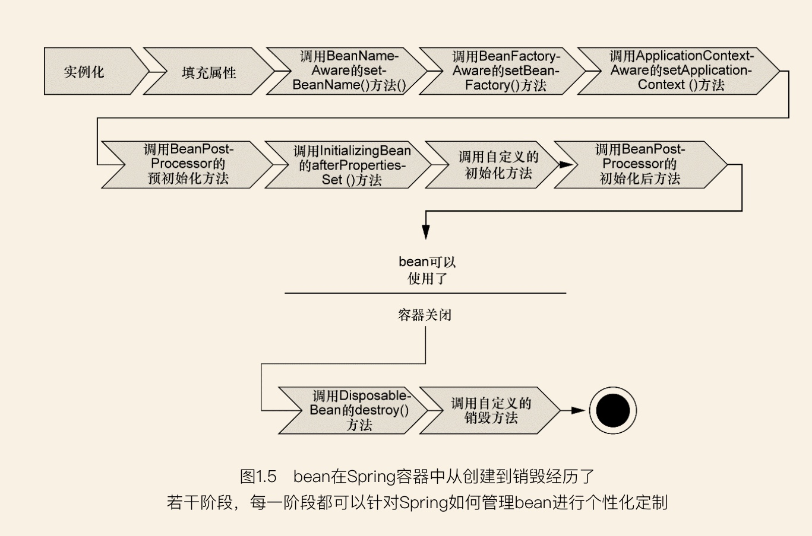

### Customizing the Nature of Bean
生命周期总览：

##### Lifecycle Callbacks
* Initialization Callbacks(优先级从高到低)  
  使用@PostConstruct注解；  
  实现org.springframework.beans.factory.InitializingBean接口，调用afterPropertiesSet()方法；  
  In the case of XML-based configuration metadata, you can use the init-method attribute to specify the name of the 
  method that has a void no-argument signature.  
* Destruction Callbacks(优先级从高到低)  
  使用@PreDestroy注解；  
  实现org.springframework.beans.factory.DisposableBean，调用destroy()方法；  
  With XML-based configuration metadata, you can use the destroy-method attribute on the <bean/>
  
##### 容器启动或停止回调
* Lifecycle接口
```java
public interface Lifecycle {
    // 当容器启动时调用
    void start();
    // 当容器停止时调用
    void stop();
    // 当前组件的运行状态
    boolean isRunning();
}
```
需要手动执行上下文start(),stop()方法，才能触发生命周期方法执行。  
* SmartLifecycle接口
  它本身除了继承了Lifecycle接口还继承了一个Phased接口，其接口定义如下：  
```java
public interface Phased { 
    /**    
     * Return the phase value of this object.    
     */
    int getPhase();
}
```
 通过上面接口定义的方法，我们可以指定不同Bean方法回调方法执行的优先级。  
```java
public interface SmartLifecycle extends Lifecycle, Phased {

    int DEFAULT_PHASE = Integer.MAX_VALUE;

    // 不需要显示的调用容器的start方法及stop方法也可以执行Bean的start方法跟stop方法
    default boolean isAutoStartup() {
        return true;
    }

    // 容器停止时调用的方法
    default void stop(Runnable callback) {
        stop();
        callback.run();
    }

    // 优先级，默认最低
    @Override
    default int getPhase() {
        return DEFAULT_PHASE;
    }

}
```
当我们启动容器时，如果有Bean实现了SmartLifecycle接口，其getPhase()方法返回的值越小，那么对于的start方法执行的时间就会越早，stop方法执行的时机就会越晚。
因此，一个实现SmartLifecycle的对象，它的getPhase()方法返回Integer.MIN_VALUE将是第一个执行start方法的Bean和最后一个执行Stop方法的Bean。  

##### ApplicationContextAware and BeanNameAware
提供获取ApplicationContext和BeanName的方式；  
The callback is invoked after population of normal bean properties but before an initialization callback such as InitializingBean,
afterPropertiesSet, or a custom init-method.  

##### The ResourceLoaderAware Interface
实现ResourceLoaderAware接口或者通过注入的方式获取ResourceLoader，操作资源文件。

### Container Extension Points
##### Customizing Beans by Using a BeanPostProcessor（可以用来处理自定义注解，例如Autowired标签的解析逻辑主要在AutowiredAnnotationBeanPostProcessor类中）
```java
public interface BeanPostProcessor {
    @Nullable
    default Object postProcessBeforeInitialization(Object bean, String beanName) throws BeansException {
        return bean;
    }

    @Nullable
    default Object postProcessAfterInitialization(Object bean, String beanName) throws BeansException {
        return bean;
    }
}
```
当一个BeanPostProcessor的实现类注册到Spring IOC容器后，对于该Spring IOC容器所创建的每个bean实例在初始化方法（如afterPropertiesSet和任意已声明的init方法）
调用前，将会调用BeanAOP——面向切面编程,通过为目标类织入切面的方式,实现对目标类功能的增强。按切面被织如到目标类中的时间划分,主要有以下几种:PostProcessor中的postProcessBeforeInitialization方法，而在bean实例初始化方法调用完成后，
则会调用BeanPostProcessor中的postProcessAfterInitialization方法。  

spring容器通过BeanPostProcessor给了我们一个机会对Spring管理的bean进行再加工。