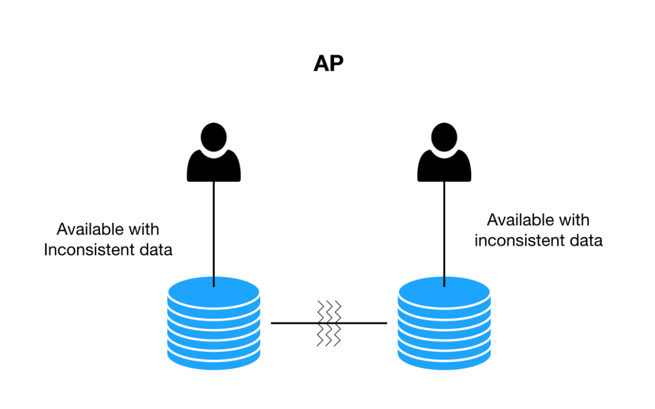
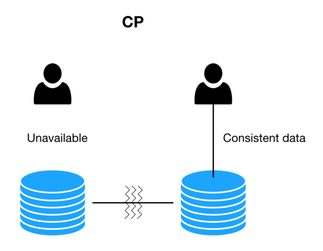
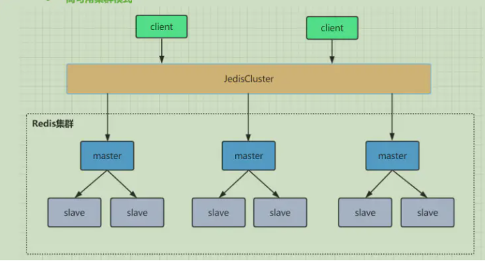

分布式系统：指互相连接并共享数据的节点集合。

## CAP 理论

* 一致性（Consistency）：写操作之后进行读操作无论在哪个节点都需要返回写操作的值；
* 可用性（Availability）：非故障的节点在合理的时间内返回合理的响应；
* 分区容错性（Partition Tolerance）：当网络出现分区后，系统依然能够继续旅行社职责。  
   
  什么是网络分区？分布式系统中，多个节点之前的网络本来是连通的，但是因为某些故障（比如部分节点网络出了问题、结点宕机、网络波动、Gc stop World）某些节点之间不连通了，整个网络就分成了几块区域，这就叫网络分区。

在分布式的环境下，网络无法做到100%可靠，有可能出现故障，因此分区是一个必须的选项，如果选择了CA而放弃了P，若发生分区现象，为了保证C，系统需要禁止写入，
此时就与A发生冲突，如果是为了保证A，则会出现正常的分区可以写入数据，有故障的分区不能写入数据，则与C就冲突了。因此分布式系统理论上不可能选择CA架构，而必须选择CP或AP架构。

AP:When there is no partition tolerance, the system is available but with inconsistent data.  

CP:When there is no partition tolerance, system is not fully available. But the data is consistent.  

### Redis in CAP

在单机版的Redis中，每个Master之间是没有任何通信的，所以我们一般在Jedis客户端或者Codis这样的代理中做Pre-sharding。按照CAP理论来说，单机版的Redis属于保证CP(Consistency &
Partition-Tolerancy)
而牺牲A(Availability)，也就说Redis能够保证所有用户看到相同的数据（一致性，因为Redis不自动冗余数据）和网络通信出问题时，暂时隔离开的子系统能继续运行（分区容忍性，因为Master之间没有直接关系，不需要通信），
但是不保证某些结点故障时，所有请求都能被响应（可用性，某个Master结点挂了的话，那么它上面分片的数据就无法访问了）。  
PS：这里我理解的Redis单机版多个Master指的是多个服务器上分别部署一个Redis单机版，这些Redis之间并不存在数据交流，所以自然可以保证P，并由代理保证C。

有了Cluster功能后，Redis从一个单纯的NoSQL内存数据库变成了分布式NoSQL数据库，CAP模型也从CP变成了AP。也就是说，通过自动分片和冗余数据，Redis具有了真正的分布式能力，
某个结点挂了的话，因为数据在其他结点上有备份，所以其他结点顶上来就可以继续提供服务，保证了Availability。然而，也正因为这一点，Redis无法保证曾经的强一致性了。这也是CAP理论要求的，三者只能取其二。   
PS：某个Master挂了，会选取一个Slave顶替升级为Master，保证了A，但由于主从复制不及时的问题会无法保证C。

redis集群是一个由多个主从节点群组成的分布式服务器群。  

## BASE 理论

BASE理论是对CAP的延伸和补充，是对CAP中的AP方案的一个补充，即使在选择AP方案的情况下，如何更好的最终达到C。

BASE是基本可用，柔性状态，最终一致性三个短语的缩写，核心的思想是即使无法做到强一致性，但应用可以采用适合的方式达到最终一致性。

## 实际应用

### 服务注册中心

* zookeeper  
  zookeeper选择CP，即任何时刻对zookeeper的访问请求能得到一致性的数据结果。zk更多是作为分布式协调服务的存在，只不过因为它的特性被dubbo
  赋予了注册中心，它的职责更多是保证数据（配置数据，状态数据）在管辖下的所有服务之间保持一致，所有这个就不难理解为何zk被设计成CP而不是AP，zk最核心的算法ZAB，就是为了解决分布式系统下数据在多个服务之间一致同步的问题。  
   
* eureka  
  eureka选择AP，eureka在设计时优先保证可用性，每一个节点都是平等的，一部分节点挂掉不会影响到正常节点的工作，不会出现类似zk的选举leader的过程，客户端发现向某个节点注册或连接失败，会自动切换到其他的节点，只要有一台eureka存在，就可以保证整个服务处在可用状态，只不过有可能这个服务上的信息并不是最新的信息。

服务注册应该选择CP还是AP？  
对于服务注册来说，针对同一个服务，即使注册中心的不同节点保存的服务注册信息不相同，也并不会造成灾难性的后果，对于服务消费者来说，能消费才是最重要的，就算拿到的数据不是最新的数据，消费者本身也可以进行尝试失败重试。总比为了追求数据的一致性而获取不到实例信息整个服务不可用要好。  
所以，对于服务注册来说，可用性比数据一致性更加的重要，选择AP。

### 分布式锁

* 基于数据库实现  
  对于单主却无法自动切换主从的mysql来说，基本就无法实现P分区容错性。Mysql通常会使用单主多从的方式部署，数据库写操作是一个单点，一旦数据库挂掉，就导致锁的不可用。这种方式基本不在CAP的一个讨论范围。  

* 基于Redis实现  
  哨兵模式故障转移是由sentinel集群进行监控判断，当maser出现异常即复制中止，重新推选新slave成为master，sentinel在重新进行选举并不在意主从数据是否复制完毕具备一致性。  
 
  所以redis的复制模式是属于AP的模式。保证可用性，在主从复制中“主”有数据，但是可能“从”还没有数据，这个时候，一旦主挂掉或者网络抖动等各种原因，可能会切换到“从”节点，这个时候可能会导致两个业务线程同时获取得两把锁。  
  
  redis采用了AP模型，它本身无法确保我们对一致性的要求。redis官方推荐redLock算法来保证。（redlock？）
* 基于zookeeper实现  
  zk的模式是CP模型，也就是说，当zk锁提供给我们进行访问的时候，在zk集群中能确保这把锁在zk的每一个节点都存在。  

分布式锁中，redis的实现性能更高，zookeeper的实现更加可靠。

### 分布式事务

[分布式事务](./分布式事务.md)