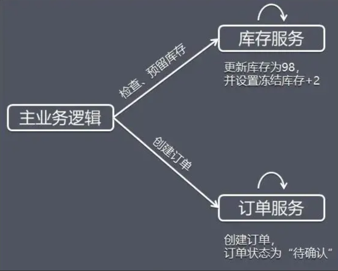
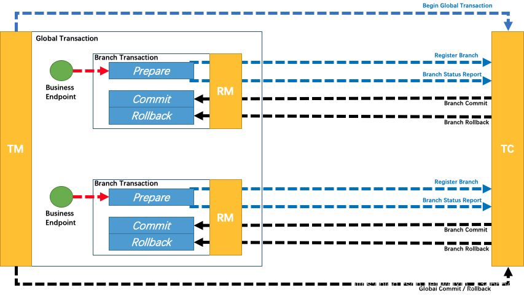

## 事务概述

### 本地事务

#### 事务特性

* Atomicity-原子性：同一个事务的所有操作，要么全部完成，要么全部不完成
* Consistency-一致性：在事务开始之前和结束之后，数据库的完整性未被破坏（符合预期）
* Isolation-隔离性：可以防止多个事务交叉执行时导致数据不一致；隔离级别由低到高依次为：
    * 读未提交（Read uncommitted）
    * 读已提交（read committed，RC），Oracle 等多数数据库的默认隔离级别
    * 可重复读（repeatable read，RR），Mysql 的默认隔离级别
    * 串行化（Serializable）
* Durability-持久性：事务结束后，对数据的修改就是永久性的

#### InnoDB 事务实现原理

事务的 ACID 是通过 InnoDB 日志和锁来保证。

事务的隔离性是通过数据库锁的机制实现的，持久性通过 redo log（重做日志）来实现，原子性和一致性通过 undo log 来实现。

undo log 的原理很简单，为了满足事务的原子性，在操作任何数据之前，首先将数据备份到一个地方（这个存储数据备份的地方称为 undo log）。 然后进行数据的修改。如果出现了错误或者用户执行了 ROLLBACK 语句，系统可以利用
undo log 中的备份将数据恢复到事务开始之前的状态。

和 undo log 相反，redo log 记录的是新数据的备份。在事务提交前，只要将 redo log 持久化即可，不需要将数据持久化。当系统崩溃时，虽然数据没有持久化， 但是 redo log 已经持久化。系统可以根据 redo
log 的内容，将所有数据恢复到最新的状态。

### 分布式事务

#### CAP 原则

* Consistency-一致性：更新操作成功后，所有节点在同一时间的数据完全一致
* Availability-可用性：用户访问数据时，系统是否能在正常响应时间返回结果
* Partition tolerance-分区容错性：系统在遇到部分节点或网络分区故障的时候，仍然能够提供满足一致性和可用性的服务

当前普遍认为 CAP 三者只能同时满足其二，而 P 通常是需要保证的（因为节点故障或网络异常难以避免），Zookeeper 选择的是 CP（选举期间无法对外提供服务，即不保证 A）， Eureka 选择的是
AP（选举期间也可以提供服务，但不保证各节点数据完全一致）。

#### BASE 理论

* Basically Available，基本可用
* Soft state，软状态/柔性事务
* Eventual consistency，最终一致性

CAP 中一致性和可用性权衡的结果，既然强一致性难以做到，那退而求其次，只要最终数据是一致的，中间短暂的不一致通常认为是可以忍受的。

[CAP和BASE理论](./CAP和BASE理论.md)

## 分布式事务解决方案

### 2PC

基于 XA 协议，各大主流数据库已有自己的实现。

#### 阶段：

* 第一阶段（prepare）：
    * 协调者向所有参与者发送事务内容，询问是否可以提交事务，并等待所有参与者答复；
    * 各参与者执行事务操作，将 undo 和 redo 信息记入事务日志中（但不提交事务）；
    * 如参与者执行成功，给协调者反馈 yes，即可以提交；如执行失败，给协调者反馈 no，即不可提交。
* 第二阶段（commit/rollback）：协调者基于各个事务参与者的准备状态，来决策是事务提交 Commit() 或事务回滚 Rollback()。如果协调者收到了参与者的失败消息或者超时，
  直接给每个参与者发送回滚（rollback）消息；否则，发送提交（commit）消息。参与者根据协调者的指令执行提交或者回滚操作， 释放所有事务处理过程中使用的锁资源。（注意：必须在最后阶段释放锁资源）


#### 伪代码

XA 事务，通过 Start 启动一个 XA 事务，并且被置为 Active 状态，处在 active 状态的事务可以执行 SQL 语句，通过 END 方法将 XA 事务置为 IDLE 状态。处于 IDLE 状态可以执行 PREPARE
操作或者 COMMIT…ONE PHASE 操作， 也就是二阶段提交中的第一阶段，PREPARED 状态的 XA事务的时候就可以 Commit 或者 RollBack，也就是二阶段提交的第二阶段。

场景： 模拟现金 + 红包组合支付，假设我们购买了 100 块钱的东西，90块使用现金支付，10 块红包支付，现金和红包处在不同的库。假设：现在有两个库：xa_account(账户库，现金库)、xa_red_account(红包库)。
两个库下面都有一张 account 表，account 表中的字段也比较简单，就 id、user_id、balance_amount 三个字段。

```java
public class XaDemo {
    public static void main(String[] args) throws Exception {
        // 是否开启日志
        boolean logXaCommands = true;

        // 获取账户库的 rm(ap做的事情)
        Connection accountConn = DriverManager.getConnection("jdbc:mysql://127.0.0.1:3306/xa_account?useUnicode=true&characterEncoding=utf8", "root", "xxxxx");
        XAConnection accConn = new MysqlXAConnection((JdbcConnection) accountConn, logXaCommands);
        XAResource accountRm = accConn.getXAResource();

        // 获取红包库的RM
        Connection redConn = DriverManager.getConnection("jdbc:mysql://106.12.12.xxxx:3306/xa_red_account?useUnicode=true&characterEncoding=utf8", "root", "xxxxxx");
        XAConnection Conn2 = new MysqlXAConnection((JdbcConnection) redConn, logXaCommands);
        XAResource redRm = Conn2.getXAResource();

        // XA 事务开始了
        // 全局事务
        byte[] globalId = UUID.randomUUID().toString().getBytes();

        // 就一个标识
        int formatId = 1;

        // 账户的分支事务
        byte[] accBqual = UUID.randomUUID().toString().getBytes();
        ;
        Xid xid = new MysqlXid(globalId, accBqual, formatId);

        // 红包分支事务
        byte[] redBqual = UUID.randomUUID().toString().getBytes();
        ;
        Xid xid1 = new MysqlXid(globalId, redBqual, formatId);

        try {
            // 账号事务开始 此时状态：ACTIVE
            accountRm.start(xid, XAResource.TMNOFLAGS);
            // 模拟业务
            String sql = "update account set balance_amount=balance_amount-90 where user_id=1";
            PreparedStatement ps1 = accountConn.prepareStatement(sql);
            ps1.execute();
            accountRm.end(xid, XAResource.TMSUCCESS);

            // 红包分支事务开始
            redRm.start(xid1, XAResource.TMNOFLAGS);
            // 模拟业务
            String sql1 = "update account set balance_amount=balance_amount-10 where user_id=1";
            PreparedStatement ps2 = redConn.prepareStatement(sql1);
            ps2.execute();
            redRm.end(xid1, XAResource.TMSUCCESS);
            // XA 事务 此时状态：PREPARED  
            // 第二阶段：TM 根据第一阶段的情况决定是提交还是回滚
            boolean onePhase = false; //TM判断有2个事务分支，所以不能优化为一阶段提交
            if (rm1_prepare == XAResource.XA_OK && rm2_prepare == XAResource.XA_OK) {
                accountRm.commit(xid, onePhase);
                redRm.commit(xid1, onePhase);
            } else {
                accountRm.rollback(xid);
                redRm.rollback(xid1);
            }
        } catch (Exception e) {
            // 出现异常，回滚
            accountRm.rollback(xid);
            redRm.rollback(xid1);
            e.printStackTrace();
        }
    }
}
```

#### 缺点：

* 性能：在阶段一需要所有的参与者都返回状态后才能进入第二阶段，并且要把相关的全局资源锁定住，这种同步阻塞的操作，会影响整体事务的并发度；
* 可靠性：如果协调者存在单点故障问题，如果协调者出现故障，参与者将一直处于锁定状态；
* 数据不一致：在二阶段提交的阶段中，当协调者向参与者发送 commit 请求之后，发生了局部网络异常或者在发送commit请求过程中协调者发生了故障，这会导致只有一部分参与者接受到了 commit 请求。 而在这部分参与者接到
  commit 请求之后就会执行 commit 操作，但是其他未接到commit请求的机器则无法执行事务提交。于是整个分布式系统便出现了数据不一致性的现象。

### 3PC

相比于二阶提交（2PC）多了一个预提交阶段，同时协调者和参与者都引入超时机制。

**多出来的阶段其实是将 2PC 中的 prepare 阶段拆分为 CanCommit 和 PreCommit 两个阶段。CanCommit 阶段询问是否可以完成本次事务，PreCommit 阶段 记录 undo log 和 redo
log，并协调者反馈是否准备好。**

#### 阶段：

第一阶段（CanCommit 阶段）：是一种事务询问操作，事务的协调者向所有参与者询问“**你们是否可以完成本次事务？**”，如果参与者节点认为自身可以完成事务就返回 YES，否则
NO。而在实际的场景中参与者节点会对自身逻辑进行事务尝试，其实说白了就是检查下自身状态的健康性，看有没有能力进行事务操作。


第二阶段（PreCommit 阶段）：在阶段一中，如果所有的参与者都返回 Yes 的话，那么就会进入 PreCommit 阶段进行事务预提交。此时分布式事务协调者会向所有的参与者节点发送 PreCommit
请求，参与者收到后开始执行事务操作，并将 Undo 和 Redo 信息记录到事务日志中。参与者执行完事务操作后（此时属于未提交事务的状态），就会向协调者反馈"Ack"表示我已经准备好提交了， 并等待协调者的下一步指令。


第三阶段（DoCommit阶段）：在阶段二中如果所有的参与者节点都可以进行 PreCommit 提交，那么协调者就会从“预提交状态”->“提交状态”。然后向所有的参与者节点发送"doCommit"
请求，参与者节点在收到提交请求后就会各自执行事务提交操作，并向协调者节点反馈"Ack"消息，协调者收到所有参与者的"Ack"消息后完成事务。

相反，如果有一个参与者节点未完成PreCommit的反馈或者反馈超时，那么协调者都会向所有的参与者节点发送abort请求，从而中断事务。


#### 对比 2PC

* 首先引入了超时机制避免事务长时间阻塞；
* 多一个环节，性能稍差；
* 依然存在数据不一致问题。

### TCC

TCC 本质上是一个业务层面上的 2PC，他要求业务在使用TCC模式时必须实现三个接口 Try()、Confirm() 和 Cancel()。2PC无法解决宕机问题，那 TCC 如何解决 2PC 无法应对宕机问题的缺陷的呢？答案是不断重试。

TCC 和 2PC 看起来很像，TCC 和 2PC 最大的区别是，2PC 是偏数据库层面的，而 TCC 是纯业务层面。

#### 阶段


TCC 是服务化的二阶段编程模型，其 Try、Confirm、Cancel 3 个方法均由业务编码实现：

* Try 操作作为一阶段，负责资源的检查和预留；
* Confirm 操作作为二阶段提交操作，执行真正的业务；
* Cancel 是预留资源的取消。

##### Try 阶段

Try 仅是一个初步操作，它和后续的 Confirm 一起才能真正构成一个完整的业务逻辑（可以理解为 Try 阶段只完成了业务逻辑的一部分，剩下的一部分交由 Confirm 阶段完成）。

这个阶段主要完成：

* 完成所有业务检查(一致性)；
* 预留必须业务资源(准隔离性)；
* Try 尝试执行业务。

假设商品库存为 100，购买数量为 2，这里检查和更新库存的同时，冻结用户购买数量的库存，同时创建订单，订单状态为待确认。



##### Confirm/Cancel 阶段

根据 Try 阶段服务是否全部正常执行，继续执行确认操作（Confirm）或取消操作（Cancel）。

Confirm 和 Cancel 操作满足幂等性，如果 Confirm 或 Cancel 操作执行失败，将会不断重试直到执行完成。

Confirm：当 Try 阶段服务全部正常执行，执行确认业务逻辑操作。


这里使用的资源一定是 Try 阶段预留的业务资源。在 TCC 事务机制中认为，如果在 Try 阶段能正常的预留资源，那 Confirm 一定能完整正确的提交。

Confirm 阶段也可以看成是对 Try 阶段的一个补充，Try+Confirm 一起组成了一个完整的业务逻辑。 这里 Confirm 阶段的逻辑是把 Try 阶段保存的冻结库存减 2，同时修改 Try 阶段创建的订单状态为"成功"，
代表完成了整个业务。

Cancel：当 Try 阶段存在服务执行失败， 进入 Cancel 阶段。


Cancel 取消执行，释放 Try 阶段预留的业务资源，上面的例子中，Cancel 操作会把冻结的库存释放，恢复库存，并更新订单状态为取消。

#### 设计要点

##### 空回滚

如果协调者的 Try() 请求因为网络超时失败，那么协调者在阶段二时会发送 Cancel() 请求，而这时这个事务参与者实际上之前并没有执行 Try() 操作而直接收到了 Cancel() 请求。

针对这个问题，TCC 模式要求在这种情况下 Cancel() 能直接返回成功，也就是要允许「空回滚」。

##### 防悬挂

接着上面的问题 1，Try() 请求超时，事务参与者收到 Cancel() 请求而执行了空回滚，但就在这之后网络恢复正常，事务参与者又收到了这个 Try() 请求，所以 Try() 和 Cancel()
发生了悬挂，也就是先执行了 Cancel() 后又执行了 Try()。针对这个问题，TCC 模式要求在这种情况下，事务参与者要记录下 Cancel() 的事务ID，当发现 Try() 的事务 ID 已经被回滚，则直接忽略掉该请求。

##### 幂等性

Confirm() 和 Cancel() 的实现必须是幂等的。当这两个操作执行失败时协调者都会发起重试。

#### 代码实现逻辑

1. 初始化：向事务管理器注册新事务，生成全局事务唯一 ID；
2. try 阶段执行：try 相关的代码执行，期间注册相应的调用记录，发送 try 执行结果到事务管理器，执行成功由事务管理器执行 confirm 或者 cancel 步骤；
3. confirm 阶段：事务管理器收到 try 执行成功信息，根据事务 ID，进入事务 confirm 阶段执行，confirm 失败进入 cancel，成功则结束;
4. cancel 阶段：事务管理器收到 try 执行失败或者 confirm 执行失败，根据事务 ID，进入 cancel 阶段执行后结束，如果失败了，打印日志或者告警，让人工参与处理，也可记录失败，系统不断对 cancel 进行重试。

#### 总结

相比于 2PC 具有如下优势：

* 性能提升：具体业务来实现控制资源锁的粒度变小，不会锁定整个资源；
* 数据最终一致性：基于 Confirm 和 Cancel 的幂等性，保证事务最终完成确认或者取消，保证数据的一致性；
* 可靠性：解决了 XA 协议的协调者单点故障问题，由主业务方发起并控制整个业务活动，业务活动管理器也变成多点，引入集群；
* 支持度：该模式对有无本地事务控制都可以支持使用面广。**2PC 依赖于数据库本身的事务利用 undo log 进行回滚，而 TCC 在业务层面，定义好补偿方法， 在需要回滚时调用，所以不依赖本地事务。由于不依赖事务，所以 TCC
  的中，多步骤的操作应该拆分为多个事务分支。**

缺点：TCC 的 Try、Confirm 和 Cancel 操作功能要按具体业务来实现，业务耦合度较高，提高了开发成本。

### SEGA

其核心思想是将长事务拆分为多个本地短事务，由 Saga 事务协调器协调，如果正常结束那就正常完成，如果某个步骤失败，则根据相反顺序一次调用补偿操作。

把转账作为例子，一个成功完成的 SAGA 事务时序图如下：


Saga 一旦到了 Cancel 阶段，那么 Cancel 在业务逻辑上是不允许失败了。如果因为网络或者其他临时故障，导致没有返回成功，那么 TM 会不断重试，直到 Cancel 返回成功。

#### Saga 事务的特点

* 并发度高，不用像 XA 事务那样长期锁定资源；
* 需要定义正常操作以及补偿操作，开发量比 XA 大；
* 一致性较弱，对于转账，可能发生 A 用户已扣款，最后转账又失败的情况。

SAGA 适用的场景较多，长事务适用，对中间结果不敏感的业务场景适用。

### 本地消息表

此方案的核心是将需要分布式处理的任务通过消息日志的方式来异步执行。消息日志可以存储到本地文本、数据库或消息队列，再通过业务规则自动或人工发起重试。人工重试更多的是应用于支付场景，通过对账系统对事后问题的处理。


对于本地消息队列来说核心是把大事务转变为小事务。举买水的例子：

1. 当你扣钱的时候，你需要在你扣钱的服务器上新增加一个本地消息表，你需要把你扣钱和写入减去水的库存到本地消息表放入同一个事务(依靠数据库本地事务保证一致性；
2. 这个时候有个定时任务去轮询这个本地事务表，把没有发送的消息，扔给商品库存服务器，叫他减去水的库存，到达商品服务器之后这个时候得先写入这个服务器的事务表，然后进行扣减，扣减成功后，更新事务表中的状态；
3. 商品服务器通过定时任务扫描消息表或者直接通知扣钱服务器，扣钱服务器本地消息表进行状态更新；
4. 针对一些异常情况，定时扫描未成功处理的消息，进行重新发送，在商品服务器接到消息之后，首先判断是否是重复的，如果已经接收，在判断是否执行，如果执行在马上又进行通知事务，如果未执行，需要重新执行需要由业务保证幂等，也就是不会多扣一瓶水。

本地消息队列是 BASE 理论，是最终一致模型，适用于对一致性要求不高的。实现这个模型时需要注意重试的幂等。

### MQ 事务

在上述的本地消息表方案中，生产者需要额外创建消息表，还需要对本地消息表进行轮询，业务负担较重。阿里开源的 RocketMQ 4.3 之后的版本正式支持事务消息，该事务消息本质上是把本地消息表放到 RocketMQ
上，解决生产端的消息发送与本地事务执行的原子性问题。


基本流程如下:

* 第一阶段Prepared消息，会拿到消息的地址；
* 第二阶段执行本地事务；
* 第三阶段通过第一阶段拿到的地址去访问消息，并修改状态。消息接受者就能使用这个消息。

补偿流程：对没有 Commit/Rollback 的事务消息（pending 状态的消息），从服务端发起一次“回查”，Producer 收到回查消息，返回消息对应的本地事务的状态，为 Commit 或者Rollback
事务消息方案与本地消息表机制非常类似，区别主要在于原先相关的本地表操作替换成了一个反查接口


如果消费超时，则需要一直重试，消息接收端需要保证幂等。如果消息消费失败，这个就需要人工进行处理，因为这个概率较低，如果为了这种小概率时间而设计这个复杂的流程反而得不偿失。

#### 特点

* 长事务仅需要分拆成多个任务，并提供一个反查接口，使用简单；
* 事务消息的回查没有好的方案，极端情况可能出现数据错误。

适用于可异步执行的业务，且后续操作无需回滚的业务。

## 分布式事务框架

### Seata

阿里巴巴开源的分布式事务中间件，全称为 Simple Extensiable Autonomous Transaction Architecture，简单的、可扩展的、自治的事务架构。

#### 各事务模式

##### Seata AT 模式

Automatic Transaction，自动提交事务，基于支持本地ACID事务的关系型数据库，换句话说，如果没有使用到数据库或者数据库不支持事务，则无法使用该模式。

优点：自动解析与回滚，对业务无侵入；缺点：部分场景无法使用。

该模式最为常用（毕竟基于事务数据库的场景最多），也是Seata的默认模式，下文描述默认均针对 AT 模式讲解。

undo_log 表会在二阶段提交（commit/roll back）完成时清空，所以正常情况下无法看见 undo_log 表中的记录。

##### Seata TCC 模式

有时也称为MT（Manual Transaction）模式，手动提交事务，基于TCC，将自定义的分支事务纳入全局事务管理。

需要自定义业务提交和回滚操作，优缺点与 AT 模式有点互补。

##### Seata SEGA 模式

长事务解决方案，适用于业务流程多，耗时长的事务。

在 Saga 模式中，业务流程中每个参与者都提交本地事务，当出现某一个参与者失败则补偿前面已经成功的参与者，一阶段正向服务和二阶段补偿服务都由业务开发实现。

优点：一阶段提交本地事务，无锁，高性能，补偿服务易于实现；缺点：不保证隔离性。

##### Seata XA 模式

#### AT 模式架构


##### TC

Transaction Coordinator，事务协调器,独立部署的服务

维护全局事务的运行状态，接收TM指令发起全局事务提交与回滚，与RM通信协调各个分支事务的提交或回滚。

##### TM

Transaction Manager，事务管理器

应用程序中的工作模块，负责开启全局事务，向TC发起全局提交或回滚的指令。

##### RM

Resource Manager，资源管理器

控制分支事务，负责分支注册、状态汇报，并接收事务协调器TC的指令，驱动分支（本地）事务的提交和回滚。

##### 注册中心

与所有的注册中心一样，这里的注册中心也记录着服务与服务地址的映射关系，通过它Seata Client（RM、TM）可以发现Seata Server（TC）集群的地址并彼此通信。

##### 配置中心

存放客户端及服务端所需的各种配置，如注册中心类型、通信编解码方式、心跳检测开关等。

支持 Nacos，Consul，Apollo，Etcd，Zookeeper 以及本地文件方式。

注意：Seata 的配置中心与应用程序本身的配置中心是独立和不相关的，当然从技术选型和使用上并无本质区别。

#### 事务原理

##### 基本概念

* 本地事务：应用直连的数据库事务
* 本地锁：数据库本身提供的锁，共享锁（S锁）/排它锁（X锁）
* 全局事务：分布式事务中所有分支事务构成一个全局事务，须满足事务的基本特性
* 全局锁：由TC提供的分布式锁；在全局事务提交前，本地事务可能已经提交，此时需要通过全局锁保证数据的一致性，如禁止修改等
* 脏读：本地事务已提交但全局事务还未提交时，读取到本地已提交的数据，之后全局事务回滚
* 脏写：本地事务已提交但全局事务还未提交时，覆盖了本地已提交的数据，之后全局事务回滚
* undo log日志：事务型数据库存储引擎层面的日志文件
* undo log表：Seata中RM维护在本地数据库中用于分支事务回滚的记录表
* XID：全局事务唯一标识

##### 本地事务

```java

@Service
public class StorageService {

    @Autowired
    private DataSource dataSource;

    public void batchUpdate() throws SQLException {
        Connection connection = null;
        PreparedStatement preparedStatement = null;
        try {
            connection = dataSource.getConnection();
            connection.setAutoCommit(false);
            String sql = "update storage_tbl set count = ? where id = ? and commodity_code = ?";
            preparedStatement = connection.prepareStatement(sql);
            preparedStatement.setInt(1, 100);
            preparedStatement.setLong(2, 1);
            preparedStatement.setString(3, "2001");
            preparedStatement.executeUpdate();
            connection.commit();
        } catch (Exception e) {
            e.printStackTrace();
        } finally {
            IOutils.close(preparedStatement);
            IOutils.close(connection);
        }
    }
}
```

###### 本地事务流程


##### Seata 分布式事务

```java
// 分支事务
public class StockServiceImpl implements StockService {
    private static final Logger LOGGER = LoggerFactory.getLogger(StockService.class);

    private JdbcTemplate jdbcTemplate;

    /**
     * Sets jdbc template.
     *
     * @param jdbcTemplate the jdbc template
     */
    public void setJdbcTemplate(JdbcTemplate jdbcTemplate) {
        this.jdbcTemplate = jdbcTemplate;
    }

    @Override
    public void deduct(String commodityCode, int count) {
        LOGGER.info("Stock Service Begin ... xid: " + RootContext.getXID());
        LOGGER.info("Deducting inventory SQL: update stock_tbl set count = count - {} where commodity_code = {}", count,
                commodityCode);

        jdbcTemplate.update("update stock_tbl set count = count - ? where commodity_code = ?",
                new Object[]{count, commodityCode});
        LOGGER.info("Stock Service End ... ");

    }
}
```

```java
// 全局事务
public class BusinessServiceImpl implements BusinessService {

    private static final Logger LOGGER = LoggerFactory.getLogger(BusinessService.class);

    private StockService stockService;
    private OrderService orderService;
    private Random random = new Random();

    @Override
    @GlobalTransactional(timeoutMills = 300000, name = "dubbo-demo-tx")
    public void purchase(String userId, String commodityCode, int orderCount) {
        LOGGER.info("purchase begin ... xid: " + RootContext.getXID());
        stockService.deduct(commodityCode, orderCount);
        orderService.create(userId, commodityCode, orderCount);
        if (random.nextBoolean()) {
            // 抛出异常前休眠一段时间，方便查看 undo_log 表用来做 rollback 的信息（undo_log 表会在二阶段提交之后清空）
            // try {
            //     Thread.sleep(50000);
            // } catch (InterruptedException e) {
            //     e.printStackTrace();
            // }
            throw new RuntimeException("random exception mock!");
        }
    }

    /**
     * Sets stock service.
     *
     * @param stockService the stock service
     */
    public void setStockService(StockService stockService) {
        this.stockService = stockService;
    }

    /**
     * Sets order service.
     *
     * @param orderService the order service
     */
    public void setOrderService(OrderService orderService) {
        this.orderService = orderService;
    }
}
```

```xml
<!--分支事务配置-->
<bean>
    <bean name="orderDataSource" class="com.alibaba.druid.pool.DruidDataSource"
          init-method="init" destroy-method="close">
        <property name="url" value="${jdbc.order.url}"/>
        <property name="username" value="${jdbc.order.username}"/>
        <property name="password" value="${jdbc.order.password}"/>
        <property name="driverClassName" value="${jdbc.order.driver}"/>
        <property name="initialSize" value="0"/>
        <property name="maxActive" value="180"/>
        <property name="minIdle" value="0"/>
        <property name="maxWait" value="60000"/>
        <property name="validationQuery" value="Select 'x' from DUAL"/>
        <property name="testOnBorrow" value="false"/>
        <property name="testOnReturn" value="false"/>
        <property name="testWhileIdle" value="true"/>
        <property name="timeBetweenEvictionRunsMillis" value="60000"/>
        <property name="minEvictableIdleTimeMillis" value="25200000"/>
        <property name="removeAbandoned" value="true"/>
        <property name="removeAbandonedTimeout" value="1800"/>
        <property name="logAbandoned" value="true"/>
        <property name="filters" value="mergeStat"/>
    </bean>

    <bean id="orderDataSourceProxy" class="io.seata.rm.datasource.DataSourceProxy">
        <constructor-arg ref="orderDataSource"/>
    </bean>

    <bean id="jdbcTemplate" class="org.springframework.jdbc.core.JdbcTemplate">
        <property name="dataSource" ref="orderDataSourceProxy"/>
    </bean>
</bean>
```

###### 分布式事务流程



完整详细的分布式事务流程：


流程详解：

1. TM 开启全局事务：全局事务拦截器对业务类进行代理，请求 TC 开启全局事务；
2. RM 执行本地操作：数据源代理在正常业务SQL执行前后生成镜像并保存到本地undo log表，用于分支事务回滚；
3. RM 注册分支事务并提交：本地 SQL 事务提交前，向 TC 注册分支事务；
    * 注册成功，提交本地事务，上报本地事务提交状态；
    * 注册失败，上报本地事务提交状态。
4. TM 发起全局事务提交或回滚：向 TC 请求发起全局事务提交或回滚；
    * 本地事务提交成功，全局事务提交；
    * 本地事务执行或提交失败，全局事务回滚。
5. TC 通知 RM 提交或回滚；
6. RM 响应 TC 请求；
    * 命令为提交，则 RM 提交本地事务；
    * 命令为回滚，则根据本地的 undo log 表构造回滚 SQL 恢复数据，之后清理 undo log。

上面流程有两个实现关键点，一是构造 undo log 记录，二是全局加锁。

###### undo log 记录

```json
{
  "branchId": 641789253,
  "undoItems": [
    {
      "afterImage": {
        "rows": [
          {
            "fields": [
              {
                "name": "id",
                "type": 4,
                "value": 1
              },
              {
                "name": "name",
                "type": 12,
                "value": "GTS"
              },
              {
                "name": "since",
                "type": 12,
                "value": "2014"
              }
            ]
          }
        ],
        "tableName": "product"
      },
      "beforeImage": {
        "rows": [
          {
            "fields": [
              {
                "name": "id",
                "type": 4,
                "value": 1
              },
              {
                "name": "name",
                "type": 12,
                "value": "TXC"
              },
              {
                "name": "since",
                "type": 12,
                "value": "2014"
              }
            ]
          }
        ],
        "tableName": "product"
      },
      "sqlType": "UPDATE"
    }
  ],
  "xid": "xid:xxx"
}
```

回滚时直接恢复到前镜像就可以了，那后镜像的作用是什么？

保存后镜像的目的是为了在恢复数据时验证这期间数据是否被修改过（未纳入全局事务管理的其它程序或人为修改），可以配置发现不一致时的处理策略。

###### 全局锁

主要用来防止被其它程序修改。

Seata 是通过全局锁来保证全局数据一致性的。

简单来说，就是 TC 的 lock_table 表里保存着当前全局事务各分支事务数据库里需要加锁的数据 pk，各分支事务在提交时需要先校验本次改动的数据里是否有被全局锁住的数据，如果有冲突则分支事务注册失败，将无法进行提交，从而防止了脏写。

脏读情况类似，在读取时同样也会去TC校验。

详细原理参考：https://www.cnblogs.com/lay2017/p/12528071.html


###### 设计总结

* 四种模式：AT 模式，最常用，基于事务型数据库，侵入性小；MT 模式，基于TCC，侵入性大；SAGA模式，长事务解决方案；XA 模式，基于支持 XA 事务的数据库
* 通过 TC 与 XID 控制全局事务提交或回滚
* 通过生成业务类代理实现业务最小侵入
* 通过 undo log 记录实现分支事务回滚
* 通过数据源驱动代理实现回滚日志构建
* 通过全局锁保证数据一致性（防止脏读、脏写）
* 在本地事务执行后提交前加全局锁，保证尽量少的锁冲突

## 参考

* [再有人问你分布式事务，把这篇扔给他](https://juejin.cn/post/6844903647197806605)
* [分布式事务最经典的七种解决方案](https://segmentfault.com/a/1190000040321750)
* [SEATA 官方文档](https://seata.io/zh-cn/docs/dev/mode/at-mode.html)
* [盘点Seata : undo-log 处理](https://juejin.cn/post/6986248944749641758)
* [分布式事务-2PC与TCC](https://juejin.cn/post/7017333689109446670)
