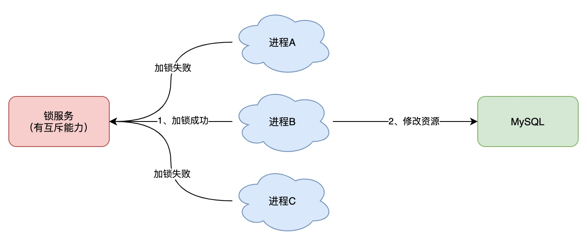
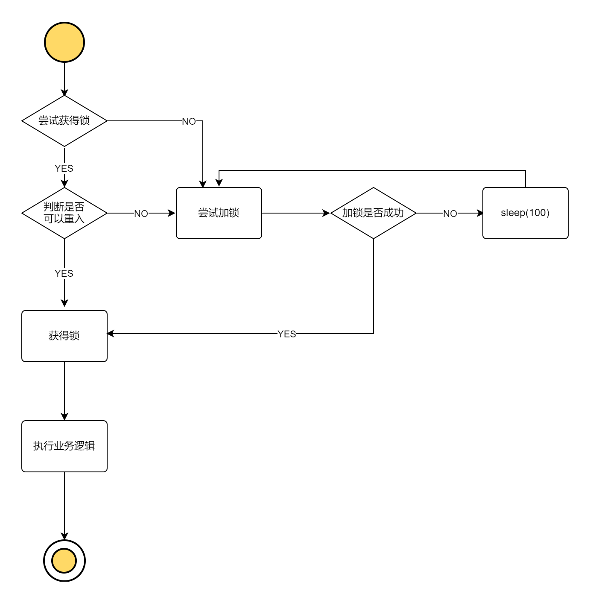

## 为什么需要分布式锁

与分布式锁相对应的是「单机锁」，我们在写多线程程序时，避免同时操作一个共享变量产生数据问题，通常会使用一把锁来「互斥」，以保证共享变量的正确性，其使用范围是在「同一个进程」中。

如果换做是多个进程，需要同时操作一个共享资源，如何互斥呢？

例如，现在的业务应用通常都是微服务架构，这也意味着一个应用会部署多个进程，那这多个进程如果需要修改 MySQL 中的同一行记录时，为了避免操作乱序导致数据错误，此时，我们就需要引入「分布式锁」来解决这个问题了。

想要实现分布式锁，必须借助一个外部系统，所有进程都去这个系统上申请「加锁」。

而这个外部系统，必须要实现「互斥」的能力，即两个请求同时进来，只会给一个进程返回成功，另一个返回失败（或等待）。

这个外部系统，可以是 MySQL，也可以是 Redis 或 Zookeeper。但为了追求更好的性能，我们通常会选择使用 Redis 或 Zookeeper 来做。

### 一个好的分布式锁应该具有的特性

* 可重入
* 同一个时间点，只有一个线程持有锁
* 容错性，当锁节点宕机时，能及时释放锁
* 高性能
* 无单点问题

## 实现方式

### MySQL

### Redis

### Zookeeper

