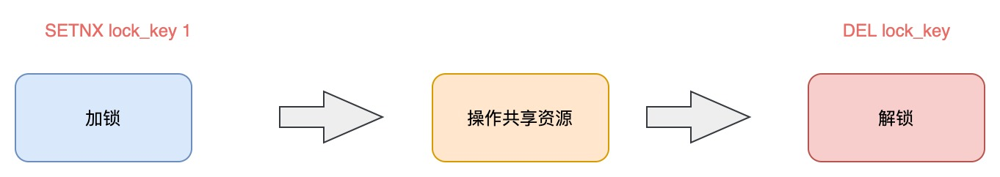
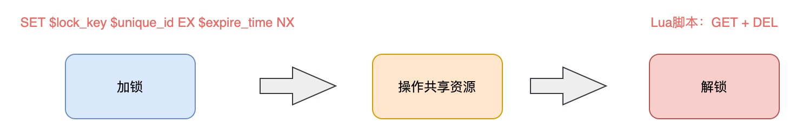

## 为什么需要分布式锁

与分布式锁相对应的是「单机锁」，我们在写多线程程序时，避免同时操作一个共享变量产生数据问题，通常会使用一把锁来「互斥」，以保证共享变量的正确性，其使用范围是在「同一个进程」中。

如果换做是多个进程，需要同时操作一个共享资源，如何互斥呢？

例如，现在的业务应用通常都是微服务架构，这也意味着一个应用会部署多个进程，那这多个进程如果需要修改 MySQL 中的同一行记录时，为了避免操作乱序导致数据错误，此时，我们就需要引入「分布式锁」来解决这个问题了。


想要实现分布式锁，必须借助一个外部系统，所有进程都去这个系统上申请「加锁」。

而这个外部系统，必须要实现「互斥」的能力，即两个请求同时进来，只会给一个进程返回成功，另一个返回失败（或等待）。

这个外部系统，可以是 MySQL，也可以是 Redis 或 Zookeeper。但为了追求更好的性能，我们通常会选择使用 Redis 或 Zookeeper 来做。

### 一个好的分布式锁应该具有的特性

* 可重入
* 同一个时间点，只有一个线程持有锁
* 容错性，当锁节点宕机时，能及时释放锁
* 高性能
* 无单点问题

## 实现方式

整体流程：


### MySQL

基于数据库的分布式锁, 常用的一种方式是使用表的唯一约束特性。当往数据库中成功插入一条数据时, 代表只获取到锁。将这条数据从数据库中删除，则释放锁。

我们需要创建一张表：

```sql
CREATE TABLE `methodLock` (
  `id` int(11) NOT NULL AUTO_INCREMENT COMMENT '主键',
  `method_name` varchar(64) NOT NULL DEFAULT '' COMMENT '锁定的方法名',
  `cust_id` varchar(1024) NOT NULL DEFAULT '客户端唯一编码',
  `update_time` timestamp NOT NULL DEFAULT CURRENT_TIMESTAMP ON UPDATE CURRENT_TIMESTAMP COMMENT '保存数据时间，自动生成',
  PRIMARY KEY (`id`),
  UNIQUE KEY `uidx_method_name` (`method_name `) USING BTREE
) ENGINE=InnoDB DEFAULT CHARSET=utf8;
```

添加锁：

```sql
insert into methodLock(method_name,cust_id) values (?, ?);
```

这里 cust_id 可以是机器的 mac 地址 + 线程编号, 确保一个线程只有唯一的一个编号。通过这个编号， 可以有效的判断是否为锁的创建者，从而进行锁的释放以及重入锁判断。

释放锁：

```sql
delete from methodLock where method_name = ? and cust_id = ?;
```

重入锁判断:

```sql
select 1 from methodLock where method_name = ? and cust_id = ?;
```

#### 优点

操作简单，容易理解。

#### 缺点

性能开销大。

### Redis

下面采用层层递进的方式，一步步优化 Redis 分布式锁的实现方式，解决各种各样的缺陷。

#### 最基础的实现方式

想要实现分布式锁，必须要求 Redis 有「互斥」的能力，我们可以使用 SETNX 命令，这个命令表示SET if Not eXists，即如果 key 不存在，才会设置它的值，否则什么也不做。

两个客户端进程可以执行这个命令，达到互斥，就可以实现一个分布式锁。

客户端 1 申请加锁，加锁成功：

```bash
127.0.0.1:6379> SETNX lock 1
(integer) 1     // 客户端1，加锁成功
```

客户端 2 申请加锁，因为后到达，加锁失败：

```bash
127.0.0.1:6379> DEL lock // 释放锁
(integer) 1
```

此时，加锁成功的客户端，就可以去操作「共享资源」，例如，修改 MySQL 的某一行数据，或者调用一个 API 请求。

操作完成后，还要及时释放锁，给后来者让出操作共享资源的机会。如何释放锁呢？

也很简单，直接使用 DEL 命令删除这个 key 即可：

```bash
127.0.0.1:6379> DEL lock // 释放锁
(integer) 1
```

这个逻辑非常简单，整体的路程就是这样：



但是，它存在一个很大的问题，当客户端 1 拿到锁后，如果发生下面的场景，就会造成「死锁」：

1. 程序处理业务逻辑异常，没及时释放锁
2. 进程挂了，没机会释放锁

这时，这个客户端就会一直占用这个锁，而其它客户端就「永远」拿不到这把锁了。

#### 使用 EX 解决「死锁」问题

在 Redis 2.6.12 版本之前，我们需要想尽办法，保证 SETNX 和 EXPIRE 原子性执行，还要考虑各种异常情况如何处理。

但在 Redis 2.6.12 之后，Redis 扩展了 SET 命令的参数，用这一条命令就可以了：

```bash
// 一条命令保证原子性执行
127.0.0.1:6379> SET lock 1 EX 10 NX
OK
```

这样就解决了死锁问题，也比较简单。

我们再来看分析下，它还有什么问题？

试想这样一种场景：

1. 客户端 1 加锁成功，开始操作共享资源
2. 客户端 1 操作共享资源的时间，「超过」了锁的过期时间，锁被「自动释放」
3. 客户端 2 加锁成功，开始操作共享资源
4. 客户端 1 操作共享资源完成，释放锁（但释放的是客户端 2 的锁）

这里存在两个严重的问题：
1. <strong>锁过期</strong>：客户端 1 操作共享资源耗时太久，导致锁被自动释放，之后被客户端 2 持有
2. <strong>释放别人的锁</strong>：客户端 1 操作共享资源完成后，却又释放了客户端 2 的锁

对于锁过期，我们并不能给定一个固定的过期时间，覆盖到所有的可能出现的情况，所以我们需要一个新的方法来解决这个问题。而对于释放别人的锁，我们可以加锁时使用 UUID 来解决。

#### 使用 UUID 解决释放他人锁的问题

解决办法是：客户端在加锁时，设置一个只有自己知道的「唯一标识」进去。

例如，可以是自己的线程 ID，也可以是一个 UUID（随机且唯一），这里我们以 UUID 举例：

```bash
// 锁的VALUE设置为UUID
127.0.0.1:6379> SET lock $uuid EX 20 NX
OK
```

这里假设 20s 操作共享时间完全足够，先不考虑锁自动过期的问题。

之后，在释放锁时，要先判断这把锁是否还归自己持有，伪代码可以这么写：

```
// 锁是自己的，才释放
if redis.get("lock") == $uuid:
    redis.del("lock")
```

判断 UUID 和删除锁的操作必须保证原子执行才行。

1. 客户端 1 执行 GET，判断锁是自己的
2. 客户端 2 执行了 SET 命令，强制获取到锁（虽然发生概率比较低，但我们需要严谨地考虑锁的安全性模型）
3. 客户端 1 执行 DEL，却释放了客户端 2 的锁

由此可见，这两个命令还是必须要原子执行才行。

我们可以把这个逻辑，写成 Lua 脚本，让 Redis 来执行。

因为 Redis 处理每一个请求是「单线程」执行的，在执行一个 Lua 脚本时，其它请求必须等待，直到这个 Lua 脚本处理完成，这样一来，GET + DEL 之间就不会插入其它命令了。

安全释放锁的 Lua 脚本如下：

```bash
// 判断锁是自己的，才释放
if redis.call("GET",KEYS[1]) == ARGV[1]
then
    return redis.call("DEL",KEYS[1])
else
    return 0
end
```

现在这个分布式锁已经越来越严禁了。

这里我们先小结一下，基于 Redis 实现的分布式锁，一个严谨的的流程如下：

1. 加锁：SET $lock_key $unique_id EX $expire_time NX
2. 操作共享资源
3. 释放锁：Lua 脚本，先 GET 判断锁是否归属自己，再 DEL 释放锁



好，有了这个完整的锁模型，让我们重新回到前面提到的第一个问题。

锁过期时间不好评估怎么办？

#### 使用守护线程解决固定过期时间的问题

加锁时，先设置一个过期时间，然后我们开启一个「守护线程」，定时去检测这个锁的失效时间，如果锁快要过期了，操作共享资源还未完成，那么就自动对锁进行「续期」，重新设置过期时间。

如果你是 Java 技术栈，幸运的是，已经有一个库把这些工作都封装好了：Redisson。

Redisson 是一个 Java 语言实现的 Redis SDK 客户端，在使用分布式锁时，它就采用了「自动续期」的方案来避免锁过期，这个守护线程我们一般也把它叫做「看门狗」线程。

这个 SDK 提供的 API 非常友好，它可以像操作本地锁的方式，操作分布式锁。如果你是 Java 技术栈，可以直接把它用起来。

上面分析的 Redis 实现的分布式锁都没考虑到多实例部署的情况，而我们在使用 Redis 时，一般会采用主从集群 + 哨兵的模式部署，这样做的好处在于，当主库异常宕机时，哨兵可以实现「故障自动切换」，把从库提升为主库，继续提供服务，以此保证可用性。

那当「主从发生切换」时，这个分布锁会依旧安全吗？

试想这样的场景：

1. 客户端 1 在主库上执行 SET 命令，加锁成功
2. 此时，主库异常宕机，SET 命令还未同步到从库上（主从复制是异步的）
3. 从库被哨兵提升为新主库，这个锁在新的主库上，丢失了！

可见，当引入 Redis 副本后，分布锁还是可能会受到影响。

#### 使用 Redlock 解决主从复制锁丢失的问题

### Zookeeper

## 思考

### 分布式锁和乐观锁的比较

### Redis 分布式锁守护线程相比于不设置过期时间的意义

### Redis 分布式锁守护线程的原理

