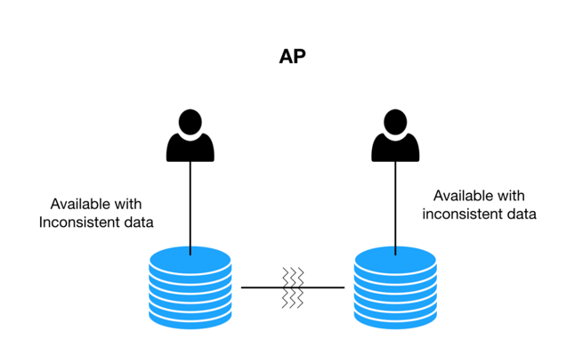
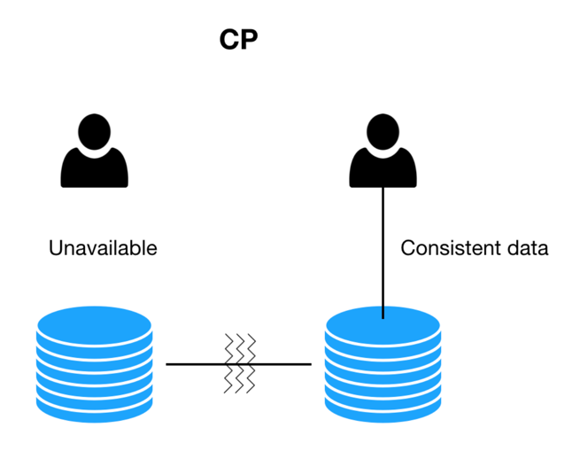

分布式系统：指互相连接并共享数据的节点集合。

## CAP 理论

* 一致性（Consistency）：写操作之后进行读操作无论在哪个节点都需要返回写操作的值；
* 可用性（Availability）：非故障的节点在合理的时间内返回合理的响应；
* 分区容错性（Partition Tolerance）：当网络出现分区后，系统依然能够继续旅行社职责。  
   
  什么是网络分区？分布式系统中，多个节点之前的网络本来是连通的，但是因为某些故障（比如部分节点网络出了问题）某些节点之间不连通了，整个网络就分成了几块区域，这就叫网络分区。

在分布式的环境下，网络无法做到100%可靠，有可能出现故障，因此分区是一个必须的选项，如果选择了CA而放弃了P，若发生分区现象，为了保证C，系统需要禁止写入，
此时就与A发生冲突，如果是为了保证A，则会出现正常的分区可以写入数据，有故障的分区不能写入数据，则与C就冲突了。因此分布式系统理论上不可能选择CA架构，而必须选择CP或AP架构。

AP:When there is no partition tolerance, the system is available but with inconsistent data.  

CP:When there is no partition tolerance, system is not fully available. But the data is consistent.  

## BASE 理论

BASE理论是对CAP的延伸和补充，是对CAP中的AP方案的一个补充，即使在选择AP方案的情况下，如何更好的最终达到C。

BASE是基本可用，柔性状态，最终一致性三个短语的缩写，核心的思想是即使无法做到强一致性，但应用可以采用适合的方式达到最终一致性。

## 实际应用

### 服务注册中心

* zookeeper  
  zookeeper选择CP，即任何时刻对zookeeper的访问请求能得到一致性的数据结果。zk更多是作为分布式协调服务的存在，只不过因为它的特性被dubbo
  赋予了注册中心，它的职责更多是保证数据（配置数据，状态数据）在管辖下的所有服务之间保持一致，所有这个就不难理解为何zk被设计成CP而不是AP，zk最核心的算法ZAB，就是为了解决分布式系统下数据在多个服务之间一致同步的问题。  
   
* eureka  
  eureka选择AP，eureka在设计时优先保证可用性，每一个节点都是平等的，一部分节点挂掉不会影响到正常节点的工作，不会出现类似zk的选举leader的过程，客户端发现向某个节点注册或连接失败，会自动切换到其他的节点，只要有一台eureka存在，就可以保证整个服务处在可用状态，只不过有可能这个服务上的信息并不是最新的信息。
  
服务注册应该选择CP还是AP？  
对于服务注册来说，针对同一个服务，即使注册中心的不同节点保存的服务注册信息不相同，也并不会造成灾难性的后果，对于服务消费者来说，能消费才是最重要的，就算拿到的数据不是最新的数据，消费者本身也可以进行尝试失败重试。总比为了追求数据的一致性而获取不到实例信息整个服务不可用要好。  
所以，对于服务注册来说，可用性比数据一致性更加的重要，选择AP。

### 分布式锁

* 基于数据库实现  
  对于单主却无法自动切换主从的mysql来说，基本就无法实现P分区容错性
