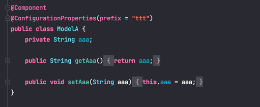
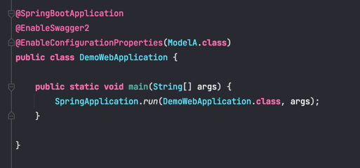

### Spring Boot Features
#### SpringApplication
**Customizing SpringApplication**  
If the SpringApplication defaults are not to your taste, you can instead create a local instance and customize it. 
For example, to turn off the banner, you could write:
```java
public static void main(String[] args) {
    SpringApplication app = new SpringApplication(MySpringConfiguration.class);
    app.setBannerMode(Banner.Mode.OFF);
    app.run(args);
}
```
It is also possible to configure the SpringApplication by using an application.properties file.  

**Application Availability**  
2.3新增，业务应用可以通过注入ApplicationAvailability来获取Liveness State和Readiness State，也可以订阅这两个actuator的变更事件：
```java
@Component
public class ReadinessStateExporter {

    @EventListener
    public void onStateChange(AvailabilityChangeEvent<ReadinessState> event) {
        switch (event.getState()) {
        case ACCEPTING_TRAFFIC:
            // create file /tmp/healthy
        break;
        case REFUSING_TRAFFIC:
            // remove file /tmp/healthy
        break;
        }
    }

}
```
业务应用可以通过Spring系统事件机制来修改Liveness State和Readiness State(此时/actuator/health/liveness和/actuator/health/readiness
的返回值都会发生变更):
```java
@Component
public class LocalCacheVerifier {

    private final ApplicationEventPublisher eventPublisher;

    public LocalCacheVerifier(ApplicationEventPublisher eventPublisher) {
        this.eventPublisher = eventPublisher;
    }

    public void checkLocalCache() {
        try {
            //...
        }
        catch (CacheCompletelyBrokenException ex) {
            AvailabilityChangeEvent.publish(this.eventPublisher, ex, LivenessState.BROKEN);
        }
    }

}
```
**Accessing Application Arguments**
通过注入org.springframework.boot.ApplicationArguments bean获取参数。

**Using the ApplicationRunner or CommandLineRunner**  
If you need to run some specific code once the SpringApplication has started, you can implement the ApplicationRunner or
CommandLineRunner interfaces.

#### Externalized Configuration
**Importing Additional Data**
可以通过spring.config.import在application.properties中引入其他配置，而且引入的配置优先级更高。

**Type-safe Configuration Properties**  
@ConfigurationProperties将配置文件中的配置属性映射到相应的Java Bean。需要配合@Component,@EnableConfigurationProperties或
@ConfigurationPropertiesScan使用：  
使用方式1：配合@Component使用  
  
使用方式2：使用@EnableConfigurationProperties告知Spring Boot开启支持（也可用在带有@Configuration注解的类上）  
  
使用方式3：配合@ConfigurationPropertiesScan使用（也可以加载启动类上）  


#### Profiles
```java
@Configuration(proxyBeanMethods = false)
@Profile("production")
public class ProductionConfiguration {

    // ...

}
```
我们可以使用以下方式来激活：
```properties
spring.profiles.active=dev,hsqldb
```
或者启动时指定命令行参数：--spring.profiles.active=dev,hsqldb  

**Profile Groups**
```properties
spring.profiles.group.production[0]=proddb
spring.profiles.group.production[1]=prodmq
```
Our application can now be started using --spring.profiles.active=production to active the production, proddb and 
prodmq profiles in one hit.  

#### Developing Web Applications
**@JsonComponent**  
在Spring Boot中如果你使用的是Jackson，当你想要自定义序列化方式时，使用@JsonComponent可以无需手动操作OjectMapper对象，直接在该注解注释的
类中添加序列化与反序列化方法就可以了。  
```java
@JsonComponent
public class Example {

    public static class Serializer extends JsonSerializer<SomeObject> {
        // ...
    }

    public static class Deserializer extends JsonDeserializer<SomeObject> {
        // ...
    }
}
```

**MessageCodesResolver**  
如果设置了spring.mvc.message-codes-resolver-format属性，则在springmvc进行参数绑定的时候，会出现一些绑定错误，那么他就会讲绑定错误的
信息传递到BindingResult中，可以从其对象中获取。  
```java
@ResponseBody
@RequestMapping(value="/save", method= RequestMethod.GET)
public String saveUser(User user, BindingResult bindingResult) {
    // 如果在绑定的时候，发生错误，那么错误信息就会保存在BindingResult 这里面，从里里面可以获取具体信息
    if(bindingResult.hasErrors()){
        bindingResult.getAllErrors().forEach(item -> {
            System.out.println(item.getObjectName());
            System.out.println(item.getArguments());
            System.out.println(item.getDefaultMessage());
            System.out.println(item.getCode());
        });
    }
    return "success";
}
```

**Static Content**  
默认资源文件放在resources目录下/static里(或者/public，/resources，/META-INF/resources)，可以通过spring.web.resources.static-locations
指定静态资源存放路径；  
默认情况下，静态资源文件访问路径为/**，但是可以通过spring.mvc.static-path-pattern指定静态资源的访问路径：
```yaml
spring:
  mvc:
    static-path-pattern: "/resources/**"
```

**ConfigurableWebBindingInitializer**  
[参考连接]：https://blog.csdn.net/Michean/article/details/90901450  
配合PropertyEditorSupport，可自定义属性编辑器，例如将将字符进行HTML转义或者将String参数转换成Date
